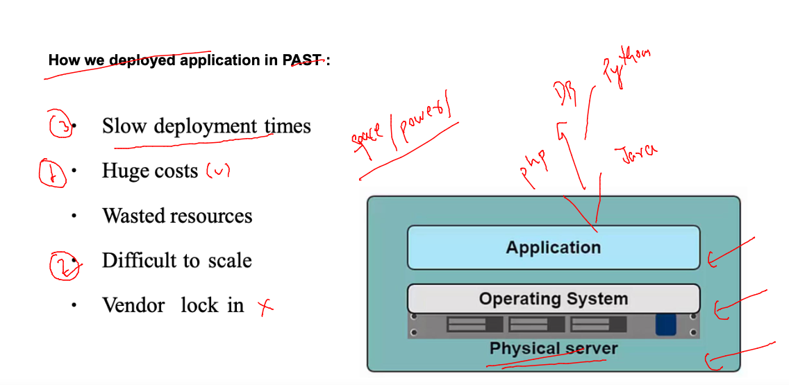
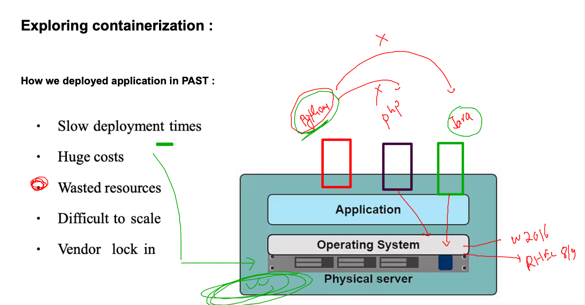
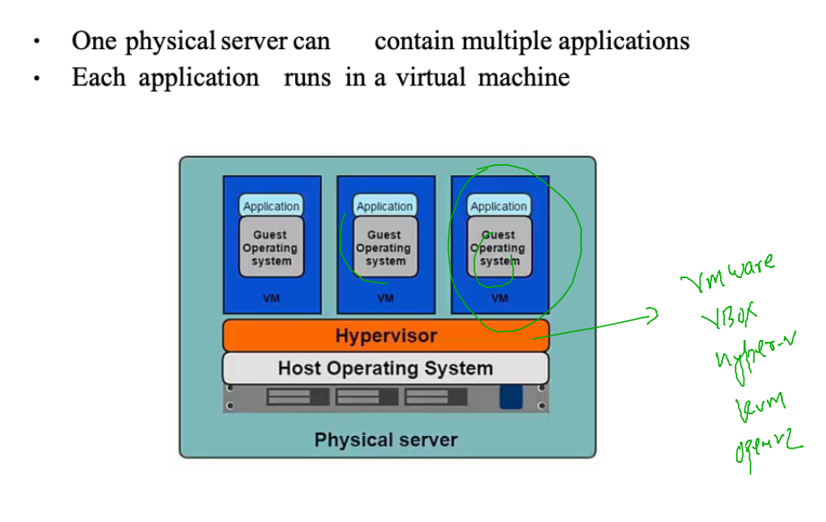
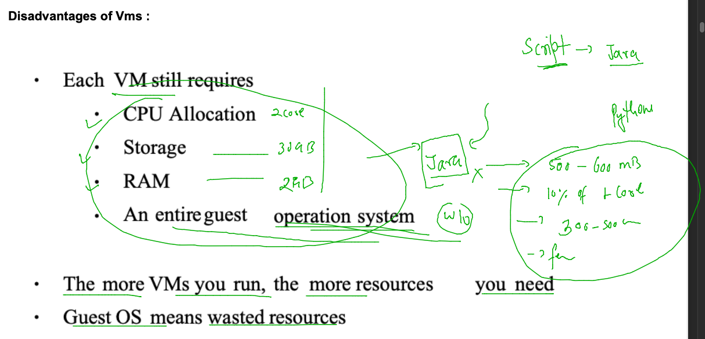
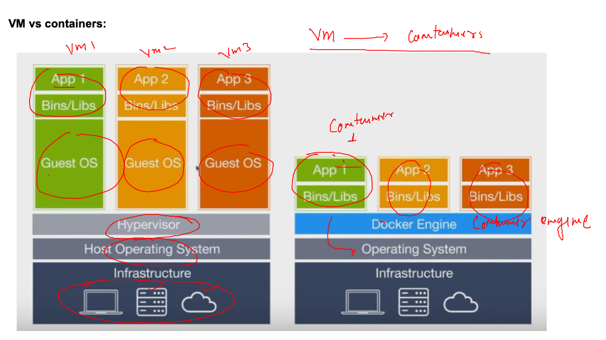
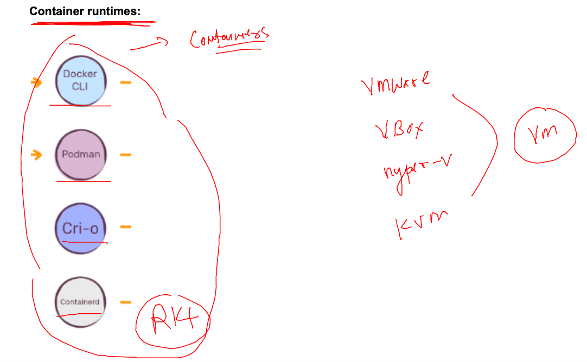
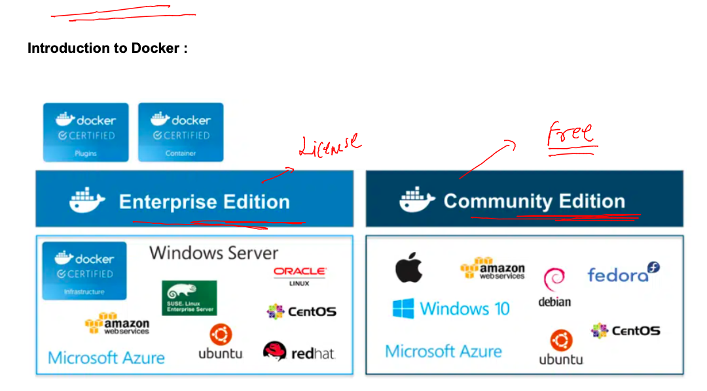
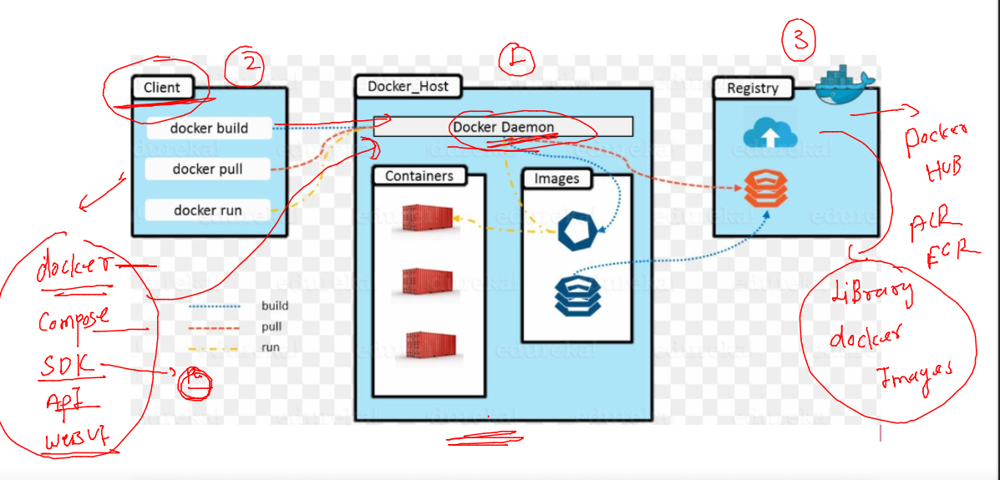
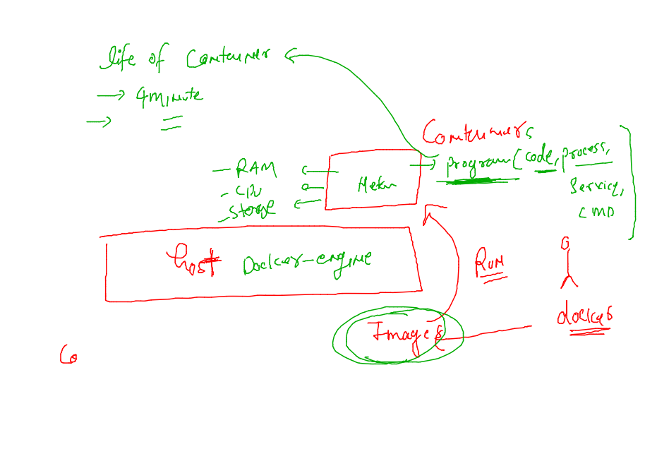

## getting started with Docker 

### problem with app deployment in bare-metal 



### app conflict in bare-metal server



### solution of bare-metal related problems using -- Virtaul machine 



### problem with vm 



## Introduction to containers 



### technology to manage containers 



### Docker CE vs docker ee 



## access docker host with personal user account 

```
fire@ashutoshhs-MacBook-Air ~ % ssh  ashu@43.205.200.84
ashu@43.205.200.84's password: 

       __|  __|_  )
       _|  (     /   Amazon Linux 2 AMI
      ___|\___|___|

https://aws.amazon.com/amazon-linux-2/
-bash: warning: setlocale: LC_CTYPE: cannot change locale (UTF-8): No such file or directory
[ashu@docker-host ~]$ 
[ashu@docker-host ~]$ whoami
ashu
[ashu@docker-host ~]$ hostname
docker-host
[ashu@docker-host ~]$ 


```

### Installing docker-ce on Linux VM --make linux mv is having 3.10 or later kernel version 

```
[root@docker-host ~]# yum install docker 
Failed to set locale, defaulting to C
Loaded plugins: extras_suggestions, langpacks, priorities, update-motd
amzn2-core                                                                                               | 3.7 kB  00:00:00     
Resolving Dependencies
--> Running transaction check
---> Package docker.x86_64 0:20.10.17-1.amzn2.0.2 will be installed
--> Processing Dependency: runc >= 1.0.0 for package: docker-20.10.17-1.amzn2.0.2.x86_64
--> Processing Dependency: libcgroup >= 0.40.rc1-5.15 for package: docker-20.10.17-1.amzn2.0.2.x86_64
--> Processing Dependency: containerd >= 1.3.2 for package: docker-20.10.17-1.amzn2.0.2.x86_64
--> Processing Dependency: pigz for package: docker-20.10.17-1.amzn2.0.2.x86_64
--> Running transaction check
---> Package containerd.x86_64 0:1.6.8-1.amzn2.0.1 will be installed
---> Package libcgroup.x86_64 0:0.41-21.amzn2 will be installed
---> Package pigz.x86_64 0:2.3.4-1.amzn2.0.1 will be installed
---> Package runc.x86_64 0:1.1.4-1.amzn2.0.1 will be installed
--> Finished Dependency Resolution

Dependencies Resolved

```

### starting docker daemon service 

```
[root@docker-host ~]# systemctl start docker 
[root@docker-host ~]# systemctl status  docker 
● docker.service - Docker Application Container Engine
   Loaded: loaded (/usr/lib/systemd/system/docker.service; disabled; vendor preset: disabled)
   Active: active (running) since Mon 2023-02-20 09:29:00 UTC; 4s ago
     Docs: https://docs.docker.com
  Process: 1526 ExecStartPre=/usr/libexec/docker/docker-setup-runtimes.sh (code=exited, status=0/SUCCESS)
  Process: 1525 ExecStartPre=/bin/mkdir -p /run/docker (code=exited, status=0/SUCCESS)
 Main PID: 1530 (dockerd)
    Tasks: 10
   Memory: 21.3M
   CGroup: /system.slice/docker.service
           └─1530 /usr/bin/dockerd -H fd:// --containerd=/run/containerd/containerd.sock --default-ulimit nofile=32768:65536

Feb 20 09:29:00 docker-host dockerd[1530]: time="2023-02-20T09:29:00.361100676Z" level=info msg="ClientConn switching b...e=grpc
Feb 20 09:29:00 docker-host dockerd[1530]: time="2023-02-20T09:29:00.390311947Z" level=warning msg="Your kernel does no...eight"
Feb 20 09:29:00 docker-host dockerd[1530]: time="2023-02-20T09:29:00.390351091Z" level=warning msg="Your kernel does no...evice"
Feb 20 09:29:00 docker-host dockerd[1530]: time="2023-02-20T09:29:00.390537804Z" level=info msg="Loading containers: start."
Feb 20 09:29:00 docker-host dockerd[1530]: time="2023-02-20T09:29:00.733687372Z" level=info msg="Default bridge (docker...dress"
Feb 20 09:29:00 docker-host dockerd[1530]: time="2023-02-20T09:29:00.807392970Z" level=info msg="Loading containers: done."
Feb 20 09:29:00 docker-host dockerd[1530]: time="2023-02-20T09:29:00.819177152Z" level=info msg="Docker daemon" commit=....10.17
Feb 20 09:29:00 docker-host dockerd[1530]: time="2023-02-20T09:29:00.819282911Z" level=info msg="Daemon has completed i...ation"
Feb 20 09:29:00 docker-host systemd[1]: Started Docker Application Container Engine.
Feb 20 09:29:00 docker-host dockerd[1530]: time="2023-02-20T09:29:00.840066219Z" level=info msg="API listen on /run/docker.sock"
Hint: Some lines were ellipsized, use -l to show in full.
[root@docker-host ~]# systemctl enable   docker 
Created symlink from /etc/systemd/system/multi-user.target.wants/docker.service to /usr/lib/systemd/system/docker.service.
[root@docker-host ~]# 

```

### a non root /admin user is not allowed to connect docker host

```
[ashu@docker-host ~]$ whoami
ashu
[ashu@docker-host ~]$ docker version 
Client:
 Version:           20.10.17
 API version:       1.41
 Go version:        go1.18.6
 Git commit:        100c701
 Built:             Sat Dec  3 04:13:49 2022
 OS/Arch:           linux/amd64
 Context:           default
 Experimental:      true
Got permission denied while trying to connect to the Docker daemon socket at unix:///var/run/docker.sock: Get "http://%2Fvar%2Frun%2Fdocker.sock/v1.24/version": dial unix /var/run/docker.sock: connect: permission denied
[ashu@docker-host ~]$ 

```

### solution for a single and all users 

```
[root@docker-host ~]# usermod -aG docker ashu 
[root@docker-host ~]# 
[root@docker-host ~]# for  i in `ls /home`
> do
> usermod -aG docker $i
> done
[root@docker-host ~]# 


```

### Docker architecture 



## SOme basic docker client side operations 

### checking images on docker host 

```
[ashu@docker-host ~]$ docker images
REPOSITORY   TAG       IMAGE ID   CREATED   SIZE
[ashu@docker-host ~]$ 

```

### pulling image 

```
[ashu@docker-host ~]$ docker images
REPOSITORY   TAG       IMAGE ID   CREATED   SIZE
[ashu@docker-host ~]$ 
[ashu@docker-host ~]$ docker pull mysql
Using default tag: latest
latest: Pulling from library/mysql
197c1adcd755: Pull complete 
45f2e353f7d2: Pull complete 
68ec6ece42ef: Pull complete 
cfa4d9a7b88e: Pull complete 
64cab5858b1d: Pull complete 
92fcd248d982: Pull complete 
88635e83312d: Pull complete 
43f0427259d9: Pull complete 
79828698a290: Pull complete 
a8854781893e: Pull complete 
6c8bdf3091d9: Pull complete 
Digest: sha256:8653a170e0b0df19ea95055267def2615fc53c62df529e3750817c1a886485f0
Status: Downloaded newer image for mysql:latest
docker.io/library/mysql:latest
[ashu@docker-host ~]$ docker images
REPOSITORY   TAG       IMAGE ID       CREATED       SIZE
mysql        latest    57da161f45ac   11 days ago   517MB
[ashu@docker-host ~]$ 


```

### pulling specfic version of mysql image 

```
[ashu@docker-host ~]$ docker images
REPOSITORY   TAG       IMAGE ID       CREATED       SIZE
mysql        latest    57da161f45ac   11 days ago   517MB
[ashu@docker-host ~]$ docker pull mysql:5.7
5.7: Pulling from library/mysql
e048d0a38742: Pull complete 
c7847c8a41cb: Pull complete 
351a550f260d: Pull complete 
8ce196d9d34f: Pull complete 
17febb6f2030: Pull complete 
d4e426841fb4: Pull complete 
fda41038b9f8: Pull complete 
f47aac56b41b: Pull complete 
a4a90c369737: Pull complete 
97091252395b: Pull complete 
84fac29d61e9: Pull complete 
Digest: sha256:8cf035b14977b26f4a47d98e85949a7dd35e641f88fc24aa4b466b36beecf9d6
Status: Downloaded newer image for mysql:5.7
docker.io/library/mysql:5.7
[ashu@docker-host ~]$ docker images
REPOSITORY   TAG       IMAGE ID       CREATED       SIZE
mysql        latest    57da161f45ac   11 days ago   517MB
mysql        5.7       be16cf2d832a   2 weeks ago   455MB
[ashu@docker-host ~]$ 

```

### pulling and remove image from quay.io 

```
  25  docker pull quay.io/enxadahost/java
   26  docker pull quay.io/cki/python
   27  docker images
   28  history 
[ashu@docker-host ~]$ docker rmi  quay.io/cki/python
Untagged: quay.io/cki/python:latest
Untagged: quay.io/cki/python@sha256:ad2b66cfe3c46fb127625eca327e1e505b3a1c23a921bac0f78c5af84074210c
Deleted: sha256:d2c03bd6c69c227ab74f306cb4a06f63629ddef600299a048fd7b29493b31367
Deleted: sha256:bc76f5d4c3cb05c80e60590d5183b37f4871c16641fa7dc7ce2c2270d022d6e8
Deleted: sha256:26353445c16fb7c576f4fd5aa5e7faa5e23679829434f04937890279a1ef13d6
```

### life of a container in running state 



### creating container from alpine image

```
[ashu@docker-host ~]$ docker run  --name ashuc1 -d  alpine:latest   sleep 200 
b73d6835f8131344524179f68457918c2d76242dfbeb8d7164e10ef4e6a83a54
[ashu@docker-host ~]$ docker  ps
CONTAINER ID   IMAGE           COMMAND       CREATED         STATUS         PORTS     NAMES
b73d6835f813   alpine:latest   "sleep 200"   4 seconds ago   Up 3 seconds             ashuc1
[ashu@docker-host ~]$ 
```

### more commands 

```
[ashu@docker-host ~]$ docker ps  -a
CONTAINER ID   IMAGE           COMMAND       CREATED              STATUS                          PORTS     NAMES
8b46bbc2d362   alpine:latest   "sleep 200"   14 seconds ago       Up 14 seconds                             shamaa_c1
4b73919d6f3c   alpine          "sleep 100"   30 seconds ago       Up 30 seconds                             star1
2b5988ac84b3   alpine:latest   "sleep 150"   About a minute ago   Up About a minute                         serg1
a4d2280042e5   alpine:latest   "sleep 200"   About a minute ago   Up About a minute                         ihtest
f86e7fc2f4bf   alpine:latest   "sleep 10"    About a minute ago   Exited (0) About a minute ago             rbr1
abd5bd67add8   alpine:latest   "sleep 200"   About a minute ago   Up About a minute                         mfarag
2e1393505624   alpine:latest   "sleep 200"   2 minutes ago        Up 2 minutes                              ononzhc1
a334f4f457ab   alpine:latest   "sleep 60"    2 minutes ago        Exited (0) About a minute ago             amr1
2b03e2eb57ed   alpine:latest   "sleep 200"   2 minutes ago        Up 2 minutes                              csmisak_cont
215ae0732ce1   alpine:latest   "sleep 240"   2 minutes ago        Up 2 minutes                              SudTestContainer
b73d6835f813   alpine:latest   "sleep 200"   3 minutes ago        Exited (0) 29 seconds ago                 ashuc1
[ashu@docker-host ~]$ 
[ashu@docker-host ~]$ docker  start  ashuc1 
ashuc1
[ashu@docker-host ~]$ docker ps
CONTAINER ID   IMAGE           COMMAND       CREATED              STATUS              PORTS     NAMES
f6b9e47ec3b8   alpine:latest   "sleep 200"   29 seconds ago       Up 29 seconds                 lmchibante
8b46bbc2d362   alpine:latest   "sleep 200"   51 seconds ago       Up 51 seconds                 shamaa_c1
4b73919d6f3c   alpine          "sleep 100"   About a minute ago   Up About a minute             star1
2b5988ac84b3   alpine:latest   "sleep 150"   2 minutes ago        Up 2 minutes                  serg1
a4d2280042e5   alpine:latest   "sleep 200"   2 minutes ago        Up 2 minutes                  ihtest
abd5bd67add8   alpine:latest   "sleep 200"   2 minutes ago        Up 2 minutes                  mfarag
2e1393505624   alpine:latest   "sleep 200"   3 minutes ago        Up 3 minutes                  ononzhc1
215ae0732ce1   alpine:latest   "sleep 240"   3 minutes ago        Up 3 minutes                  SudTestContainer
b73d6835f813   alpine:latest   "sleep 200"   4 minutes ago        Up 2 seconds                  ashuc1
[ashu@docker-host ~]$ 
```

### stopping a running container 

```
[ashu@docker-host ~]$ docker  stop  ashuc2
ashuc2
```
### removing a dead container / exit container 

```
[ashu@docker-host ~]$ docker  rm  ashuc1 
ashuc1
[ashu@docker-host ~]$ 


```

