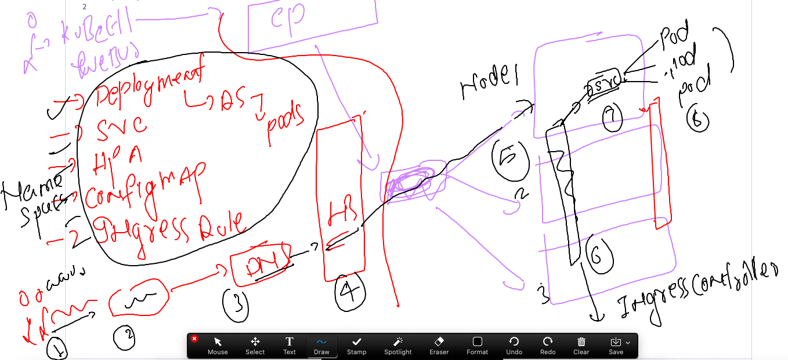
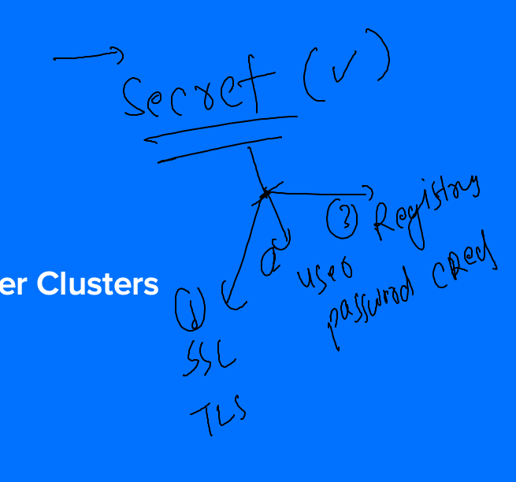
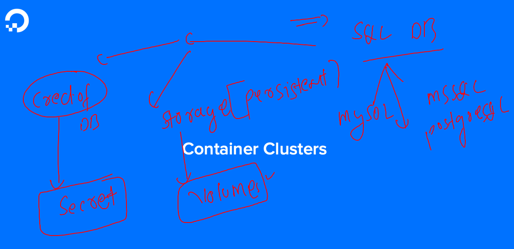

### Revision 



### Deploying private docker imgage to Registry 

### pushing image to Azure container registry {ACR} ---

```
 881  docker  tag  fdf8c61479ad   ashutoshh.azurecr.io/ui:v1 
  882  docker login ashutoshh.azurecr.io 
  883  docker push  ashutoshh.azurecr.io/ui:v1
```

### creating Deployment using above image 

```
kubectl  create  deployment ashu-dep1  --image=ashutoshh.azurecr.io/ui:v1  --port 80 --dry-run=client -o yaml >private_imgdeploy.yaml 
```

### deploy and see errors

```
[ashu@ip-172-31-29-207 final-day-k8s]$ ls
private_imgdeploy.yaml
[ashu@ip-172-31-29-207 final-day-k8s]$ kubectl apply -f  private_imgdeploy.yaml 
deployment.apps/ashu-dep1 created
[ashu@ip-172-31-29-207 final-day-k8s]$ kubectl  get  deploy 
NAME        READY   UP-TO-DATE   AVAILABLE   AGE
ashu-dep1   0/1     1            0           4s
[ashu@ip-172-31-29-207 final-day-k8s]$ kubectl  get po 
NAME                        READY   STATUS         RESTARTS   AGE
ashu-dep1-bb6f986f8-xbpxq   0/1     ErrImagePull   0          12s
[ashu@ip-172-31-29-207 final-day-k8s]$ kubectl  describe  pod ashu-dep1-bb6f986f8-xbpxq 
Name:             ashu-dep1-bb6f986f8-xbpxq
Namespace:        ashu-space
Priority:         0
Service Account:  default
Node:             node3/172.31.89.79
Start Time:       Fri, 03 Mar 2023 08:35:12 +0000
Labels:           app=ashu-dep1
                  pod-template-hash=bb6f986f8
Annotations:      cni.projectcalico.org/containerID: 44175be48849f96188bfe05b73dab88f347e9a0e3d32fcbc7681cbce0b32e465
                  cni.projectcalico.org/podIP: 192.168.135.47/32
                  cni.projectcalico.org/podIPs: 192.168.135.47/32
Status:           Pending
IP:               192.168.135.47
IPs:
  IP:           192.168.135.47
Controlled By:  ReplicaSet/ashu-dep1-bb6f986f8
Containers:
  ui:
    Container ID:   
    Image:          ashutoshh.azurecr.io/ui:v1
    Image ID:       
    Port:           80/TCP
    Host Port:      0/TCP
    State:          Waiting
      Reason:       ImagePullBackOff
    Ready:          False
    Restart Count:  0
    Environment:    <none>
    Mounts:
      /var/run/secrets/kubernetes.io/serviceaccount from kube-api-access-q59fv (ro)
Conditions:
  Type              Status
  Initialized       True 
  Ready             False 
  ContainersReady   False 
  PodScheduled      True 
Volumes:
  kube-api-access-q59fv:
    Type:                    Projected (a volume that contains injected data from multiple sources)
    TokenExpirationSeconds:  3607
    ConfigMapName:           kube-root-ca.crt
    ConfigMapOptional:       <nil>
    DownwardAPI:             true
QoS Class:                   BestEffort
Node-Selectors:              <none>
Tolerations:                 node.kubernetes.io/not-ready:NoExecute op=Exists for 300s
                             node.kubernetes.io/unreachable:NoExecute op=Exists for 300s
Events:
  Type     Reason     Age                From               Message
  ----     ------     ----               ----               -------
  Normal   Scheduled  25s                default-scheduler  Successfully assigned ashu-space/ashu-dep1-bb6f986f8-xbpxq to node3
  Normal   BackOff    22s                kubelet            Back-off pulling image "ashutoshh.azurecr.io/ui:v1"
  Warning  Failed     22s                kubelet            Error: ImagePullBackOff
  Normal   Pulling    11s (x2 over 24s)  kubelet            Pulling image "ashutoshh.azurecr.io/ui:v1"
  Warning  Failed     10s (x2 over 23s)  kubelet            Failed to pull image "ashutoshh.azurecr.io/ui:v1": rpc error: code = Unknown desc = Error response from daemon: Head "https://ashutoshh.azurecr.io/v2/ui/manifests/v1": unauthorized: authentication required, visit https://aka.ms/acr/authorization for more information.
  Warning  Failed     10s (x2 over 23s)  kubelet            Error: ErrImagePull
[ashu@ip-172-31-29-207 final-day-k8s]$ 
```

### we need to create secret to hold registry information 



### creating secret 

```
 kubectl  create  secret  docker-registry  ashu-img-secret --docker-server=ashutoshh.azurecr.io    --docker-username=ashutoshh  --docker-password="sdfsdfsdfsdgdgsdfsfsf" --dry-run=client -o yaml >secret.yaml 
 
 
```

### apply secret 

```
ashu@ip-172-31-29-207 final-day-k8s]$ ls
private_imgdeploy.yaml  secret.yaml
[ashu@ip-172-31-29-207 final-day-k8s]$ kubectl apply -f secret.yaml 
secret/ashu-img-secret created
[ashu@ip-172-31-29-207 final-day-k8s]$ kubectl  get  secret  
NAME                  TYPE                                  DATA   AGE
ashu-img-secret       kubernetes.io/dockerconfigjson        1      4s
default-token-6fpfp   kubernetes.io/service-account-token   3      46h
[ashu@ip-172-31-29-207 final-day-k8s]$ 

```

### lets call secret in Deployment file 

```
apiVersion: apps/v1
kind: Deployment
metadata:
  creationTimestamp: null
  labels:
    app: ashu-dep1
  name: ashu-dep1
spec:
  replicas: 1
  selector:
    matchLabels:
      app: ashu-dep1
  strategy: {}
  template:
    metadata:
      creationTimestamp: null
      labels:
        app: ashu-dep1
    spec:
      imagePullSecrets: # calling secret in pod section 
      - name: ashu-img-secret # name of secret 
      containers:
      - image: ashutoshh.azurecr.io/ui:v1 # image from azure container registry 
        name: ui
        ports:
        - containerPort: 80
        resources: {}
status: {}

```

### reapply it 

```
[ashu@ip-172-31-29-207 final-day-k8s]$ kubectl apply -f private_imgdeploy.yaml 
deployment.apps/ashu-dep1 configured
[ashu@ip-172-31-29-207 final-day-k8s]$ kubectl  get  po 
NAME                        READY   STATUS              RESTARTS   AGE
ashu-dep1-bb6f986f8-xbpxq   0/1     ImagePullBackOff    0          17m
ashu-dep1-d558cdf96-2ssxm   0/1     ContainerCreating   0          5s
[ashu@ip-172-31-29-207 final-day-k8s]$ kubectl  get  po 
NAME                        READY   STATUS    RESTARTS   AGE
ashu-dep1-d558cdf96-2ssxm   1/1     Running   0          10s
[ashu@ip-172-31-29-207 final-day-k8s]$ 
```

### understanding database deployment in k8s and its need also 



### creating secret to store root password of Env 

```
[ashu@ip-172-31-29-207 final-day-k8s]$ kubectl  create  secret  
Create a secret using specified subcommand.

Available Commands:
  docker-registry   Create a secret for use with a Docker registry
  generic           Create a secret from a local file, directory, or literal value
  tls               Create a TLS secret

Usage:
  kubectl create secret [flags] [options]

Use "kubectl <command> --help" for more information about a given command.
Use "kubectl options" for a list of global command-line options (applies to all commands).
[ashu@ip-172-31-29-207 final-day-k8s]$ kubectl  create  secret  generic  ashu-db-pass  --from-literal   sqlpassword="MobiDb@098" --dry-run=client -o yaml  >sql_secret.yaml 
[ashu@ip-172-31-29-207 final-day-k8s]$ kubectl apply -f sql_secret.yaml 
secret/ashu-db-pass created
[ashu@ip-172-31-29-207 final-day-k8s]$ kubectl  get  secret
NAME                  TYPE                                  DATA   AGE
ashu-db-pass          Opaque                                1      4s
ashu-img-secret       kubernetes.io/dockerconfigjson        1      15m
default-token-6fpfp   kubernetes.io/service-account-token   3      47h
[ashu@ip-172-31-29-207 final-day-k8s]$ 

```

### creating db yaml 

```
ashu@ip-172-31-29-207 final-day-k8s]$ kubectl  create  deployment  ashu-db --image=mysql --port 3306 --dry-run=client -o yaml  >db.yaml 
```

### after updating yaml

```
apiVersion: apps/v1
kind: Deployment
metadata:
  creationTimestamp: null
  labels:
    app: ashu-db
  name: ashu-db
spec:
  replicas: 1
  selector:
    matchLabels:
      app: ashu-db
  strategy: {}
  template:
    metadata:
      creationTimestamp: null
      labels:
        app: ashu-db
    spec:
      containers:
      - image: mysql
        name: mysql
        ports:
        - containerPort: 3306
        resources: {}
        env: 
        - name: MYSQL_ROOT_PASSWORD # original env variable 
          valueFrom:
            secretKeyRef:
              name: ashu-db-pass # name of secret 
              key: sqlpassword # key of secret 
status: {}

```

### creating deploy of db and check 

```
[ashu@ip-172-31-29-207 final-day-k8s]$ ls
db.yaml  private_imgdeploy.yaml  secret.yaml  sql_secret.yaml
[ashu@ip-172-31-29-207 final-day-k8s]$ kubectl apply -f db.yaml 
deployment.apps/ashu-db created
[ashu@ip-172-31-29-207 final-day-k8s]$ kubectl  get  secret
NAME                  TYPE                                  DATA   AGE
ashu-db-pass          Opaque                                1      9m52s
ashu-img-secret       kubernetes.io/dockerconfigjson        1      25m
default-token-6fpfp   kubernetes.io/service-account-token   3      47h
[ashu@ip-172-31-29-207 final-day-k8s]$ kubectl  get  deploy 
NAME      READY   UP-TO-DATE   AVAILABLE   AGE
ashu-db   0/1     1            0           10s
[ashu@ip-172-31-29-207 final-day-k8s]$ kubectl  get  po
NAME                      READY   STATUS              RESTARTS   AGE
ashu-db-fffdcdf4b-t9cfj   0/1     ContainerCreating   0          13s
[ashu@ip-172-31-29-207 final-day-k8s]$ kubectl  get  po
NAME                      READY   STATUS    RESTARTS   AGE
ashu-db-fffdcdf4b-t9cfj   1/1     Running   0          18s
[ashu@ip-172-31-29-207 final-day-k8s]$ 


```

### creating database in pod container 

```
[ashu@ip-172-31-29-207 final-day-k8s]$ kubectl  get  po
NAME                      READY   STATUS    RESTARTS   AGE
ashu-db-fffdcdf4b-t9cfj   1/1     Running   0          64s
[ashu@ip-172-31-29-207 final-day-k8s]$ 
[ashu@ip-172-31-29-207 final-day-k8s]$ 
[ashu@ip-172-31-29-207 final-day-k8s]$ kubectl  exec -it  ashu-db-fffdcdf4b-t9cfj  -- bash 
bash-4.4# 
bash-4.4# 
bash-4.4# mysql -u root -p
Enter password: 
Welcome to the MySQL monitor.  Commands end with ; or \g.
Your MySQL connection id is 8
Server version: 8.0.32 MySQL Community Server - GPL

Copyright (c) 2000, 2023, Oracle and/or its affiliates.

Oracle is a registered trademark of Oracle Corporation and/or its
affiliates. Other names may be trademarks of their respective
owners.

Type 'help;' or '\h' for help. Type '\c' to clear the current input statement.

mysql> show databases;
+--------------------+
| Database           |
+--------------------+
| information_schema |
| mysql              |
| performance_schema |
| sys                |
+--------------------+
4 rows in set (0.00 sec)

mysql> create database mobiindia;
Query OK, 1 row affected (0.01 sec)

mysql> show databases;
+--------------------+
| Database           |
+--------------------+
| information_schema |
| mobiindia          |
| mysql              |
| performance_schema |
| sys                |
+--------------------+
5 rows in set (0.00 sec)

mysql> exit;
Bye
bash-4.4# exit
exit
[ashu@ip-172-31-29-207 final-day-k8s]$ 
```
### Single YAML and Multiple APi-resources hosting 

```
apiVersion: v1
kind: Namespace
metadata:
  creationTimestamp: null
  name: ashu-splunkns
spec: {}
status: {}
---
apiVersion: v1
kind: ConfigMap
metadata:
  creationTimestamp: null
  name: sp-lic
  namespace: ashu-splunkns # namespace info
data:
  SPLUNK_START_ARGS: --accept-license
---
apiVersion: v1
data:
  SPLUNK_PASSWORD: TW9iaUAwOTgj
kind: Secret
metadata:
  creationTimestamp: null
  name: sp-pass
  namespace: ashu-splunkns

---
apiVersion: apps/v1
kind: Deployment
metadata:
  creationTimestamp: null
  labels:
    app: ashu-dep
  name: ashu-dep
  namespace: ashu-splunkns
spec:
  replicas: 1
  selector:
    matchLabels:
      app: ashu-dep
  strategy: {}
  template:
    metadata:
      creationTimestamp: null
      labels: # label of pods 
        app: ashu-dep
    spec:
      containers:
      - image: splunk/splunk:latest
        name: splunk
        ports:
        - containerPort: 8000
        resources: {}
        envFrom:
        - configMapRef:
            name: sp-lic
        - secretRef:
            name: sp-pass 
status: {}
---
apiVersion: v1
kind: Service
metadata:
  creationTimestamp: null
  labels:
    app: ashusvc1
  name: ashusvc1
  namespace: ashu-splunkns
spec:
  ports:
  - name: 1234-8000
    port: 1234
    protocol: TCP
    targetPort: 8000
  selector: # pod finder using pod labels 
    app: ashu-dep # label of pods 
  type: NodePort
status:
  loadBalancer: {}

```

### deploy it 

```
[ashu@ip-172-31-29-207 final-day-k8s]$ ls
ashusplunk.yaml  db.yaml  private_imgdeploy.yaml  secret.yaml  sql_secret.yaml
[ashu@ip-172-31-29-207 final-day-k8s]$ kubectl apply -f ashusplunk.yaml 
namespace/ashu-splunkns created
configmap/sp-lic created
secret/sp-pass created
deployment.apps/ashu-dep created
service/ashusvc1 created
[ashu@ip-172-31-29-207 final-day-k8s]$ kubectl   get  cm,secret,deploy,svc -n ashu-splunkns 
NAME                         DATA   AGE
configmap/kube-root-ca.crt   1      24s
configmap/sp-lic             1      24s

NAME                         TYPE                                  DATA   AGE
secret/default-token-zpbvs   kubernetes.io/service-account-token   3      24s
secret/sp-pass               Opaque                                1      24s

NAME                       READY   UP-TO-DATE   AVAILABLE   AGE
deployment.apps/ashu-dep   0/1     1            0           24s

NAME               TYPE       CLUSTER-IP     EXTERNAL-IP   PORT(S)          AGE
service/ashusvc1   NodePort   10.96.134.54   <none>        1234:32098/TCP   24s
[ashu@ip-172-31-29-207 final-day-k8s]$ kubectl  get po -n ashu-splunks
No resources found in ashu-splunks namespace.
[ashu@ip-172-31-29-207 final-day-k8s]$ kubectl  get po -n ashu-splunkns
NAME                        READY   STATUS              RESTARTS   AGE
ashu-dep-5b5f9c849c-c8tfr   0/1     ContainerCreating   0          45s
[ashu@ip-172-31-29-207 final-day-k8s]$ 
```


