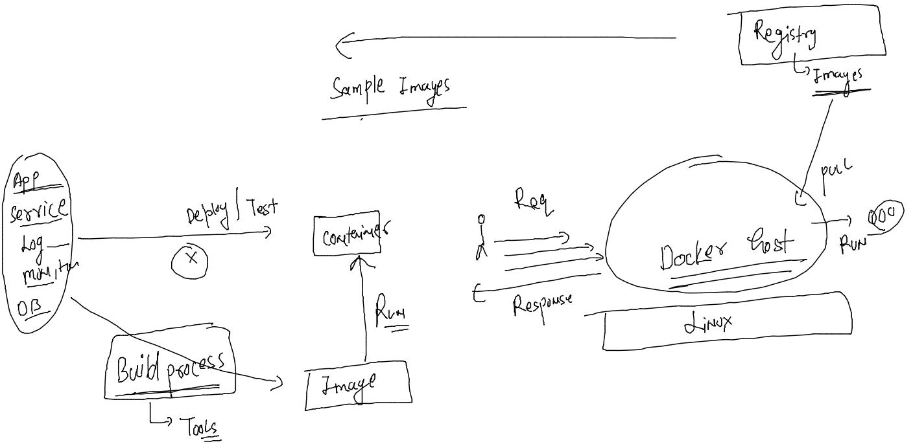

### Docker components 


### application containerization -- > source code -- build -->images --- run --> containers 



### image building tools 


### vscode setup 


### Solution of  Question 1 

```
[ashu@docker-host ashu-app-images]$ docker run -d --name ashuc1  alpine sleep 1000 
ffb52d2a562d06cc77de9fe23b2f8d291db288c13bb99c397d0ec33303a784a9
[ashu@docker-host ashu-app-images]$ docker run -d --name ashuc2  alpine sleep 1000 
efe0c4dade13bb60534f865a71c6a11fe5746eca81dd3241b938a1b9b259d2f2
[ashu@docker-host ashu-app-images]$ 


[ashu@docker-host ashu-app-images]$ 
[ashu@docker-host ashu-app-images]$ 
[ashu@docker-host ashu-app-images]$ 
[ashu@docker-host ashu-app-images]$ 
[ashu@docker-host ashu-app-images]$ docker  exec -it   ashuc1  sh 
/ # ls
bin    dev    etc    home   lib    media  mnt    opt    proc   root   run    sbin   srv    sys    tmp    usr    var
/ # pw
sh: pw: not found
/ # pwd
/
/ # echo heyyy  >/helloc1.txt 
/ # ls
bin          etc          home         media        opt          root         sbin         sys          usr
dev          helloc1.txt  lib          mnt          proc         run          srv          tmp          var
/ # exit
[ashu@docker-host ashu-app-images]$ 
```


