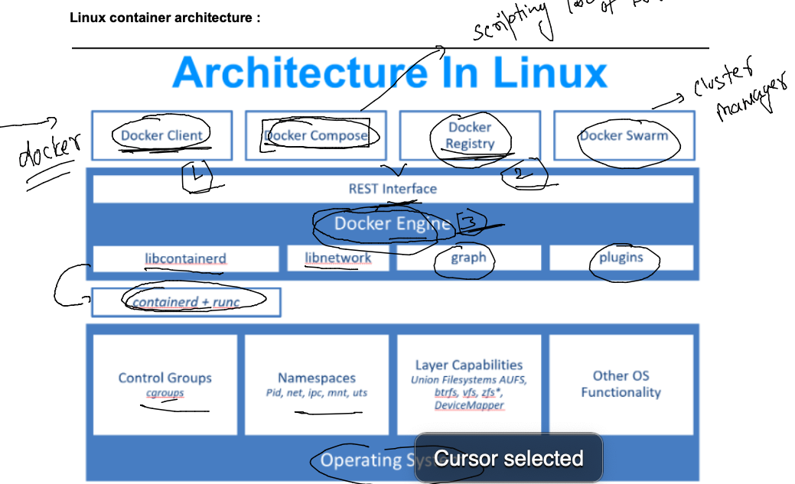

### Docker components 



### application containerization -- > source code -- build -->images --- run --> containers 


### image building tools 


### vscode setup 


### Solution of  Question 1 

```
[ashu@docker-host ashu-app-images]$ docker run -d --name ashuc1  alpine sleep 1000 
ffb52d2a562d06cc77de9fe23b2f8d291db288c13bb99c397d0ec33303a784a9
[ashu@docker-host ashu-app-images]$ docker run -d --name ashuc2  alpine sleep 1000 
efe0c4dade13bb60534f865a71c6a11fe5746eca81dd3241b938a1b9b259d2f2
[ashu@docker-host ashu-app-images]$ 


[ashu@docker-host ashu-app-images]$ 
[ashu@docker-host ashu-app-images]$ 
[ashu@docker-host ashu-app-images]$ 
[ashu@docker-host ashu-app-images]$ 
[ashu@docker-host ashu-app-images]$ docker  exec -it   ashuc1  sh 
/ # ls
bin    dev    etc    home   lib    media  mnt    opt    proc   root   run    sbin   srv    sys    tmp    usr    var
/ # pw
sh: pw: not found
/ # pwd
/
/ # echo heyyy  >/helloc1.txt 
/ # ls
bin          etc          home         media        opt          root         sbin         sys          usr
dev          helloc1.txt  lib          mnt          proc         run          srv          tmp          var
/ # exit
[ashu@docker-host ashu-app-images]$ 
```
## sample Dockerfile Example to run python code 

```
FROM python:latest
# we are refering docker hub python image 
LABEL name=ashutoshh
LABEL email=ashutoshh@linux.com 
# optional field but you can write image owner details
RUN mkdir /mycode 
# is used to run any command inside the image while building
COPY ashu.py /mycode/ashu.py 
# copy code inside docker image while image buidling time 
CMD ["python","/mycode/ashu.py"]
# to let container know how to run code while container is getting created 
# for the first time 
# is fix the default process of container 
```

### lets build our first docker image 

```
[ashu@docker-host ashu-app-images]$ ls
java-code  python-code  webapp-code
[ashu@docker-host ashu-app-images]$ 
[ashu@docker-host ashu-app-images]$ docker build  -t ashupy:1.1  python-code/ 
Sending build context to Docker daemon  3.584kB
Step 1/6 : FROM python:latest
 ---> f92346e0c39e
Step 2/6 : LABEL name=ashutoshh
 ---> Running in 78d01fbb618f
Removing intermediate container 78d01fbb618f
 ---> 5992e5eb1ca4
Step 3/6 : LABEL email=ashutoshh@linux.com
 ---> Running in 6eca31809658
Removing intermediate container 6eca31809658
 ---> d1ce700dc1a4
Step 4/6 : RUN mkdir /mycode
 ---> Running in 3f7aa317a006
Removing intermediate container 3f7aa317a006
 ---> d9a269fac8c6
Step 5/6 : COPY ashu.py /mycode/ashu.py
 ---> a847b4d0923e
Step 6/6 : CMD ["python","/mycode/ashu.py"]
 ---> Running in b6b21400383b
Removing intermediate container b6b21400383b
 ---> fdf624196e69
Successfully built fdf624196e69
Successfully tagged ashupy:1.1
[ashu@docker-host ashu-app-images]$ 
```

### lets check it 

```
ashu@docker-host ashu-app-images]$ docker images
REPOSITORY           TAG           IMAGE ID       CREATED          SIZE
ra                   1.1           583a2ae574d6   29 seconds ago   925MB
ashupy               1.1           fdf624196e69   36 seconds ago   925MB
nginx                alpine        2bc7edbc3cf2   9 days ago       40.7MB
bash                 latest        4f9df00fa318   10 days ago      12.3MB
```

### creating container using above docker image we build 

```
[ashu@docker-host ashu-app-images]$ docker  run -d -it --name ashuc11 ashupy:1.1  
ff2569469ba39bab2a8c6a9a27a461d0c63badfe4fe33642979b27866cd62e85
[ashu@docker-host ashu-app-images]$ docker  ps
CONTAINER ID   IMAGE           COMMAND                  CREATED             STATUS             PORTS     NAMES
8c3fbcac6475   rakeshpy:1.1    "python /mycode/ashu…"   2 seconds ago       Up 1 second                  rakeshC1
ff2569469ba3   ashupy:1.1      "python /mycode/ashu…"   10 seconds ago      Up 9 seconds                 ashuc11
```

### checking output 

```
[ashu@docker-host ashu-app-images]$ docker logs  ashuc11
Hello all , welcome to python..!!
Welcome to Docker training..
I am ashutoshh singh   ..!!
______________________
Hello all , welcome to python..
```


### New dockerfile example for python code 

```
FROM oraclelinux:8.5 
# we are refering docker hub python image if not present in docker host 
LABEL name=ashutoshh
LABEL email=ashutoshh@gmail.com
# optional field but you can write image owner details
RUN yum  install python3 -y 
RUN mkdir /mycode 
# is used to run any command inside the image while building
COPY ashu.py /mycode/ashu.py 
# copy code inside docker image while image buidling time 
CMD ["python3","/mycode/ashu.py"]
# to let container know how to run code while container is getting created 
# for the first time 
# is fix the default process of container 
```

### lets build image 

```
[ashu@docker-host ashu-app-images]$ cd  python-code/
[ashu@docker-host python-code]$ ls
ashunew.dockerfile  ashu.py  Dockerfile
[ashu@docker-host python-code]$ docker build -t  ashupy:2.1  -f  ashunew.dockerfile  .  
Sending build context to Docker daemon   5.12kB
Step 1/7 : FROM oraclelinux:8.5
8.5: Pulling from library/oraclelinux
42405d186b2e: Pull complete 
Digest: sha256:cda8334297e86456c96986b4070891ed58f56151e8ae2e500d9e13b1d743b2c6
Status: Downloaded newer image for oraclelinux:8.5
 ---> bbfaaa4ae074
Step 2/7 : LABEL name=ashutoshh
 ---> Running in 1d66a8b52e13
Removing intermediate container 1d66a8b52e13
 ---> ced91e4f32f6
Step 3/7 : LABEL email=ashutoshh@gmail.com
 ---> Running in cb52d1dcdbe1
Removing intermediate container cb52d1dcdbe1
 ---> c50a69bba97b
```

### docker image sharing using registry 


## More info about Docker hub 


### Docker hub image name 


### pushing image to docker hub 

```
[ashu@docker-host ashu-app-images]$ docker  images  |  grep ashu
ashupy               2.1              fce707ac27b8   28 minutes ago      454MB
ashupy               2.11             fce707ac27b8   28 minutes ago      454MB
ashupy               1.2gmailupdate   6fb1e2cfc106   43 minutes ago      925MB
ashupy               1.2              d64d5203ff8a   44 minutes ago      925MB
ashupy               1.1              fdf624196e69   About an hour ago   925MB
[ashu@docker-host ashu-app-images]$ 
[ashu@docker-host ashu-app-images]$ 
[ashu@docker-host ashu-app-images]$ docker  tag  ashupy:2.1    docker.io/dockerashu/ashupy:2.1 
[ashu@docker-host ashu-app-images]$ docker login -u dockerashu
Password: 
WARNING! Your password will be stored unencrypted in /home/ashu/.docker/config.json.
Configure a credential helper to remove this warning. See
https://docs.docker.com/engine/reference/commandline/login/#credentials-store

Login Succeeded
[ashu@docker-host ashu-app-images]$ docker push  docker.io/dockerashu/ashupy:2.1 
The push refers to repository [docker.io/dockerashu/ashupy]
50ff338be3ce: Pushed 
b881cfa33be8: Pushed 
b75ec7373c2a: Pushing [==========>                                        ]  45.37MB/218.6MB
6b0a47b1ff96: Mounted from library/oraclelinux 


```


