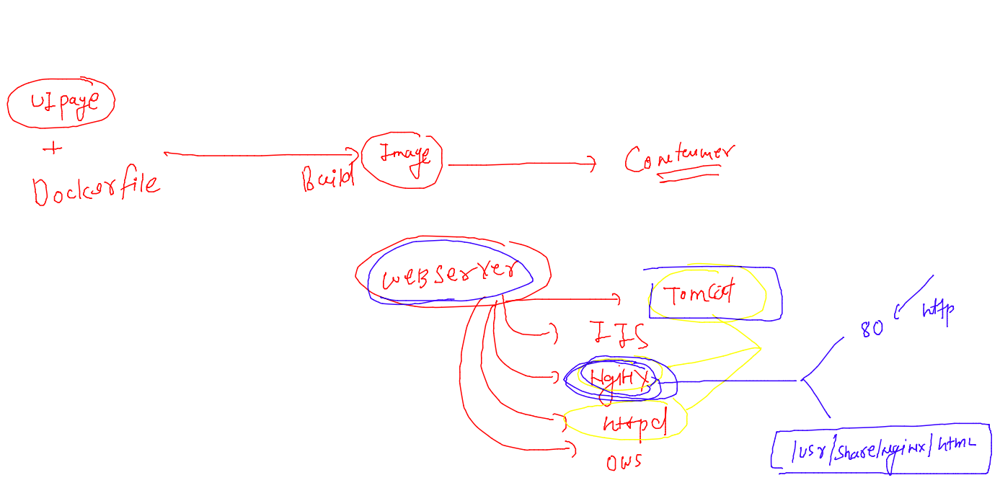
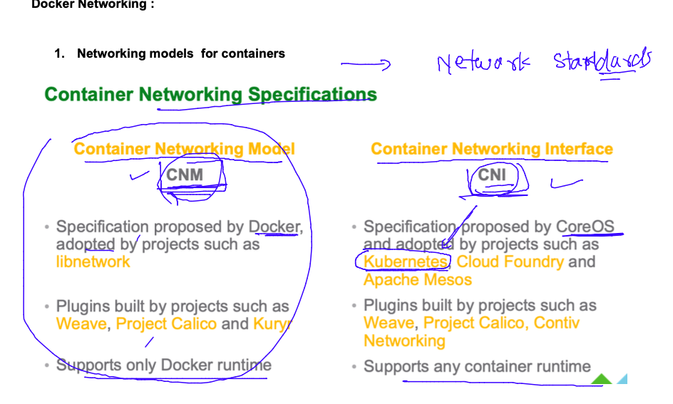
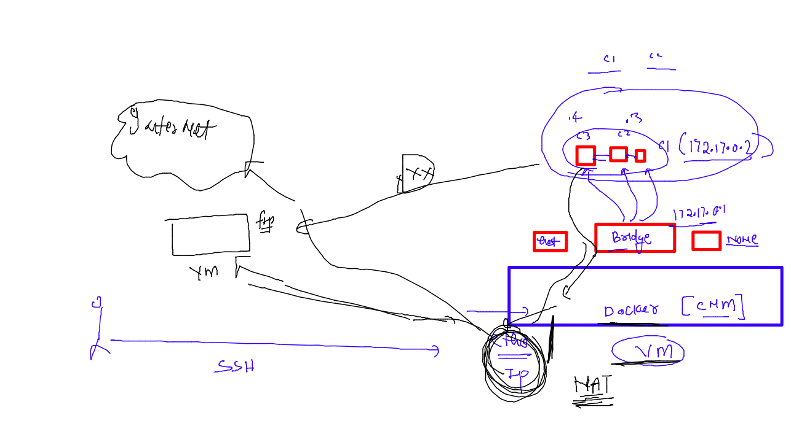
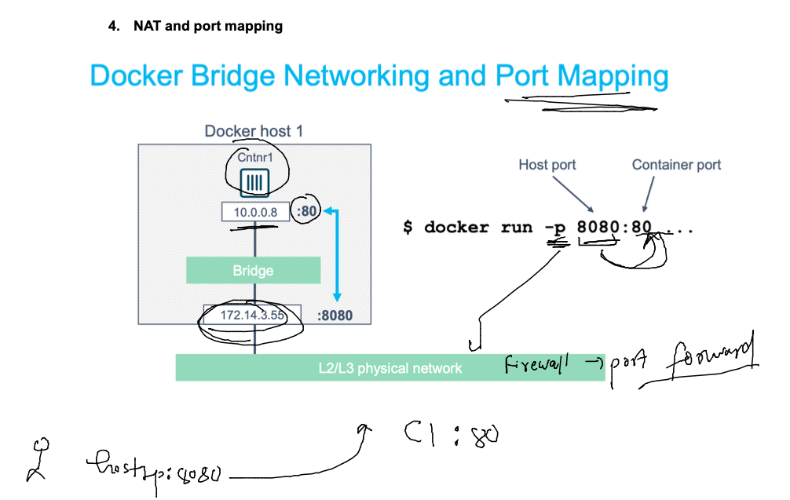

## Revision 


### container life cycle 


### socket 


## Namespace for container isolation 


### sharing files between to containers 


### demo 

```
[ashu@docker-host ashu-app-images]$ docker run -itd --name ashuc1  alpine sleep 1000
d1d3b7b6a3d952e0afbea36f97ce8d22f4fcb12dd94f32f3c71e98c0fe99c63a
[ashu@docker-host ashu-app-images]$ docker run -itd --name ashuc2  alpine sleep 1000
44b3ea905cc6442d4015768c5778f806b8fb5a2086a98b46fa4e7018b82e9fb3
[ashu@docker-host ashu-app-images]$ docker  exec -it ashuc1 sh 
/ # ls
bin    dev    etc    home   lib    media  mnt    opt    proc   root   run    sbin   srv    sys    tmp    usr    var
/ # echo hey >/helloc1.txt 
/ # ls
bin          etc          home         media        opt          root         sbin         sys          usr
dev          helloc1.txt  lib          mnt          proc         run          srv          tmp          var
/ # exit
[ashu@docker-host ashu-app-images]$ ls
java-code  python-code  webapp-code
[ashu@docker-host ashu-app-images]$ docker  cp  ashuc1:/helloc1.txt  . 
[ashu@docker-host ashu-app-images]$ ls
helloc1.txt  java-code  python-code  webapp-code
[ashu@docker-host ashu-app-images]$ docker cp helloc1.txt   ashuc2:/tmp/
[ashu@docker-host ashu-app-images]$ 
[ashu@docker-host ashu-app-images]$ docker exec -it ashuc2 ls /tmp
helloc1.txt
[ashu@docker-host ashu-app-images]$ 


```

### limting hardware resources in containers using control groups --


### creating container with RAM restriction 

```
[ashu@docker-host ashu-app-images]$ docker run -itd --name ashutest1  --memory 200M  ashupy:2.1 
```

### checking status 

```
docker stats 
=====
CONTAINER ID   NAME            CPU %     MEM USAGE / LIMIT   MEM %     NET I/O     BLOCK I/O    PIDS
7a13193d32eb   ashutest1       0.00%     3.805MiB / 200MiB   1.90%     570B / 0B   9.2MB / 0B   1
9eeb01c5a6ea   mfaragc2        0.00%     336KiB / 15.62GiB   0.00%     920B / 0B   0B / 0B      1
047f9764e79b   mfaragc1        0.00%     368KiB / 15.62GiB   0.00%     920B / 0B   0B / 0B      1
cf62ab5c9ed4   ihlushchenko2   0.00%     448KiB / 15.62GiB   0.00%     920B / 0B   0B / 0B      1
215b94d7b9bc   ihlushchenko1   0.00%     468KiB / 15.62GiB   0.00%     920B / 0B   0B / 0B      1
```

### CPU limits 

```
[ashu@docker-host ashu-app-images]$ docker run -itd --name ashutest2  --cpuset-cpus=1 --cpu-shares=400  ashupy:2.1 
d426fda5ae6b87c251e79850bae57cc60d0dead093b4f255af40bdf6323be9d1
[ashu@docker-host ashu-app-images]$ docker run -itd --name ashutest2  --cpuset-cpus=1 --cpu-shares=400  --memory 500M ashupy:2.1 


```

## Docker container networking 

### creating a docker image for sample webappge hosting 

### Understanding web servers 



### sample html code in ashu.html

```
<!DOCTYPE html>
<html lang="en">
<head>
    <meta charset="UTF-8">
    <meta http-equiv="X-UA-Compatible" content="IE=edge">
    <meta name="viewport" content="width=device-width, initial-scale=1.0">
    <title>ashu-webui</title>
</head>
<body>
    <h1> this is my first web page </h1>
    <h2> heading of webpage </h2>
    
</body>
</html>
```

### Dockerfile 

```
FROM nginx
# using image from docker hub 
LABEL   name=ashutoshh
LABEL   email=ashutoshh@linux.com
LABEL   team=mobi-dev
# all labels are optional 
#COPY ashu.html /usr/share/nginx/html/
ADD ashu.html /usr/share/nginx/html/
# COPY and ADD both are same but add can use URL as source 
# if we don't provide CMD in Dockerfile then -- base image CMD will be 
# inherited  
```

### lets build it 

```
[ashu@docker-host ashu-app-images]$ ls
java-code  python-code  webapp
[ashu@docker-host ashu-app-images]$ ls webapp/
ashu.html  Dockerfile
[ashu@docker-host ashu-app-images]$ docker build -t ashu-webui:v1  webapp/ 
Sending build context to Docker daemon  3.072kB
Step 1/5 : FROM nginx
 ---> 3f8a00f137a0
Step 2/5 : LABEL   name=ashutoshh
 ---> Running in c2c0bcd28383
Removing intermediate container c2c0bcd28383
 ---> a35f5ff909e7
Step 3/5 : LABEL   email=ashutoshh@linux.com
 ---> Running in e8967ff1b82e
Removing intermediate container e8967ff1b82e
 ---> 8be7864b7e5e
Step 4/5 : LABEL   team=mobi-dev
 ---> Running in 90e25bfa338d
Removing intermediate container 90e25bfa338d
 ---> 7bd319c6daa4
Step 5/5 : ADD ashu.html /usr/share/nginx/html/
 ---> 305540e8a62f
Successfully built 305540e8a62f
Successfully tagged ashu-webui:v1
```

### 

```
[ashu@docker-host ashu-app-images]$ docker images  |  grep ashu
ashu-webui                         v1               305540e8a62f   14 seconds ago   142MB
dockerashu/ashupy                  2.1              fce707ac27b8   24 hours ago     454MB
ashupy                             2.1              fce707ac27b8   24 hours ago     454MB
ashupy                             2.11             fce707ac27b8   24 hours ago     454MB
ashupy                             1.2gmailupdate   6fb1e2cfc106   24 hours ago     925MB
ashupy                             1.2              d64d5203ff8a   24 hours ago     925MB
```

### Container Networking Models



### default docker network bridges

```
[ashu@docker-host ashu-app-images]$ docker network ls
NETWORK ID     NAME      DRIVER    SCOPE
b517c505d7eb   bridge    bridge    local
3372299e537a   host      host      local
dbfa091ea6fa   none      null      local
[ashu@docker-host ashu-app-images]$ 

```

### exploring bridge 

```
[ashu@docker-host ashu-app-images]$ docker  inspect  bridge
[
    {
        "Name": "bridge",
        "Id": "b517c505d7eb84d5439060b40341ad20ee66dbea469fa9424521de35855d05eb",
        "Created": "2023-02-22T07:56:58.328969539Z",
        "Scope": "local",
        "Driver": "bridge",
        "EnableIPv6": false,
        "IPAM": {
            "Driver": "default",
            "Options": null,
            "Config": [
                {
                    "Subnet": "172.17.0.0/16",
                    "Gateway": "172.17.0.1"
                }
            ]
        },
        "Internal": false,
        "Attachable": false,
        "Ingress": false,
        "ConfigFrom": {
            "Network": ""
        },
        "ConfigOnly": false,
        "Containers": {},
        "Options": {
            "com.docker.network.bridge.default_bridge": "true",
            "com.docker.network.bridge.enable_icc": "true",
            "com.docker.network.bridge.enable_ip_masquerade": "true",
            "com.docker.network.bridge.host_binding_ipv4": "0.0.0.0",
            "com.docker.network.bridge.name": "docker0",
            "com.docker.network.driver.mtu": "1500"
        },
        "Labels": {}
    }
]

```

### creating container 

```
ashu@docker-host ashu-app-images]$ docker images |  grep ashu
ashu-webui                         v1               305540e8a62f   35 minutes ago   142MB
dockerashu/ashupy                  2.1              fce707ac27b8   24 hours ago     454MB
ashupy                             2.1              fce707ac27b8   24 hours ago     454MB
ashupy                             2.11             fce707ac27b8   24 hours ago     454MB
ashupy                             1.2gmailupdate   6fb1e2cfc106   25 hours ago     925MB
ashupy                             1.2              d64d5203ff8a   25 hours ago     925MB
ashupy                             1.1              fdf624196e69   25 hours ago     925MB
[ashu@docker-host ashu-app-images]$ docker run -d --name ashuwebc1  ashu-webui:v1  
7ccc94e4e5ff95fb18d7992a1d44ec546cbbd0de525b723a63b4f18aecdd054f
[ashu@docker-host ashu-app-images]$ docker ps
CONTAINER ID   IMAGE           COMMAND                  CREATED         STATUS         PORTS     NAMES
7ccc94e4e5ff   ashu-webui:v1   "/docker-entrypoint.…"   3 seconds ago   Up 2 seconds   80/tcp    ashuwebc1
[ashu@docker-host ashu-app-images]$ 

```

### Docker NEtworking NAT 


### verify internet access 

```
[ashu@docker-host ashu-app-images]$ docker  exec -it ashuwebc1 bash 
root@7ccc94e4e5ff:/# 
root@7ccc94e4e5ff:/# cat /etc/os
cat: /etc/os: No such file or directory
root@7ccc94e4e5ff:/# cat /etc/os-release 
PRETTY_NAME="Debian GNU/Linux 11 (bullseye)"
NAME="Debian GNU/Linux"
VERSION_ID="11"
VERSION="11 (bullseye)"
VERSION_CODENAME=bullseye
ID=debian
HOME_URL="https://www.debian.org/"
SUPPORT_URL="https://www.debian.org/support"
BUG_REPORT_URL="https://bugs.debian.org/"
root@7ccc94e4e5ff:/# apt update 
Get:1 http://deb.debian.org/debian bullseye InRelease [116 kB]
Get:2 http://deb.debian.org/debian-security bullseye-security InRelease [48.4 kB]
Get:3 http://deb.debian.org/debian bullseye-updates InRelease [44.1 kB]
Get:4 http://deb.debian.org/debian bullseye/main amd64 Packages [8183 kB]
Get:5 http://deb.debian.org/debian-security bullseye-security/main amd64 Packages [228 kB]
Get:6 http://deb.debian.org/debian bullseye-updates/main amd64 Packages [14.6 kB]                                                                             
Fetched 8634 kB in 7s (1231 kB/s)                                                                                                                             
Reading package lists... Done
```

### to expose container applicaiton we can do port forwarding 




###

```
[ashu@docker-host ashu-app-images]$ docker run -d --name ashuwebc2 -p 1234:80  ashu-webui:v1 
59ea9a7741440f77969dd7aa26d096facf4f9eb903175a64c6ebd2e03d822898
[ashu@docker-host ashu-app-images]$ docker ps
CONTAINER ID   IMAGE           COMMAND                  CREATED         STATUS         PORTS                                   NAMES
59ea9a774144   ashu-webui:v1   "/docker-entrypoint.…"   3 seconds ago   Up 2 seconds   0.0.0.0:1234->80/tcp, :::1234->80/tcp   ashuwebc2
[ashu@docker-host ashu-app-images]$ 


```


