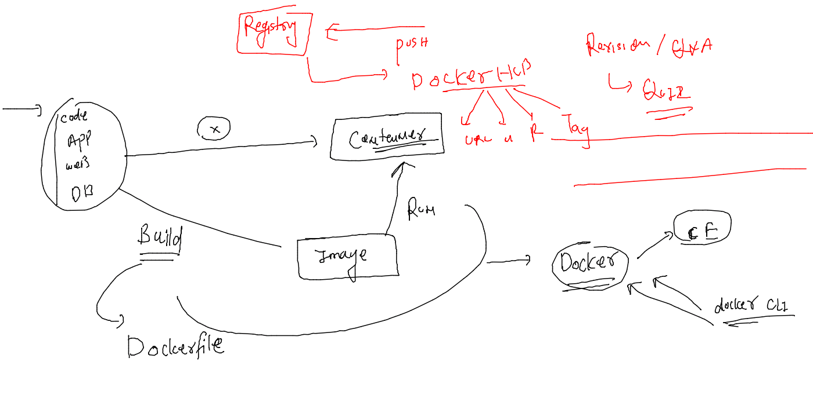
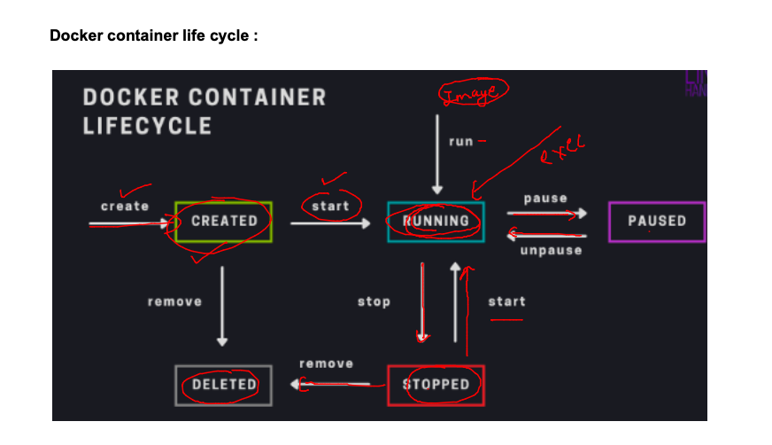
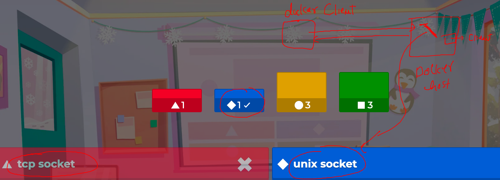
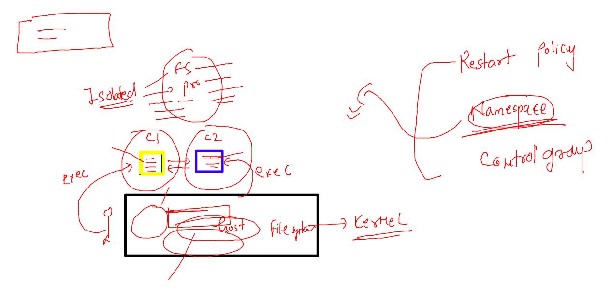
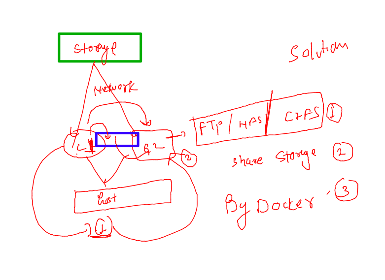
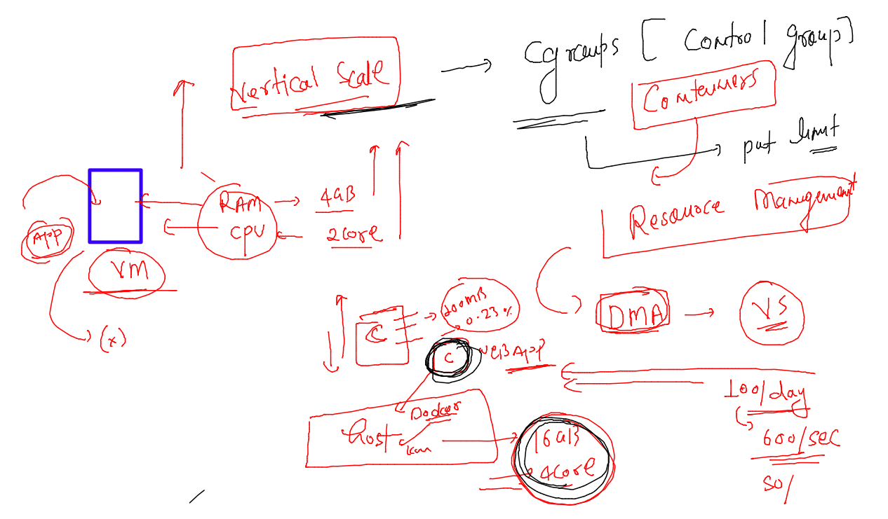

## Revision 



### container life cycle 



### socket 




## Namespace for container isolation 



### sharing files between to containers 



### demo 

```
[ashu@docker-host ashu-app-images]$ docker run -itd --name ashuc1  alpine sleep 1000
d1d3b7b6a3d952e0afbea36f97ce8d22f4fcb12dd94f32f3c71e98c0fe99c63a
[ashu@docker-host ashu-app-images]$ docker run -itd --name ashuc2  alpine sleep 1000
44b3ea905cc6442d4015768c5778f806b8fb5a2086a98b46fa4e7018b82e9fb3
[ashu@docker-host ashu-app-images]$ docker  exec -it ashuc1 sh 
/ # ls
bin    dev    etc    home   lib    media  mnt    opt    proc   root   run    sbin   srv    sys    tmp    usr    var
/ # echo hey >/helloc1.txt 
/ # ls
bin          etc          home         media        opt          root         sbin         sys          usr
dev          helloc1.txt  lib          mnt          proc         run          srv          tmp          var
/ # exit
[ashu@docker-host ashu-app-images]$ ls
java-code  python-code  webapp-code
[ashu@docker-host ashu-app-images]$ docker  cp  ashuc1:/helloc1.txt  . 
[ashu@docker-host ashu-app-images]$ ls
helloc1.txt  java-code  python-code  webapp-code
[ashu@docker-host ashu-app-images]$ docker cp helloc1.txt   ashuc2:/tmp/
[ashu@docker-host ashu-app-images]$ 
[ashu@docker-host ashu-app-images]$ docker exec -it ashuc2 ls /tmp
helloc1.txt
[ashu@docker-host ashu-app-images]$ 


```

### limting hardware resources in containers using control groups --



### creating container with RAM restriction 

```
[ashu@docker-host ashu-app-images]$ docker run -itd --name ashutest1  --memory 200M  ashupy:2.1 
```

### checking status 

```
docker stats 
=====
CONTAINER ID   NAME            CPU %     MEM USAGE / LIMIT   MEM %     NET I/O     BLOCK I/O    PIDS
7a13193d32eb   ashutest1       0.00%     3.805MiB / 200MiB   1.90%     570B / 0B   9.2MB / 0B   1
9eeb01c5a6ea   mfaragc2        0.00%     336KiB / 15.62GiB   0.00%     920B / 0B   0B / 0B      1
047f9764e79b   mfaragc1        0.00%     368KiB / 15.62GiB   0.00%     920B / 0B   0B / 0B      1
cf62ab5c9ed4   ihlushchenko2   0.00%     448KiB / 15.62GiB   0.00%     920B / 0B   0B / 0B      1
215b94d7b9bc   ihlushchenko1   0.00%     468KiB / 15.62GiB   0.00%     920B / 0B   0B / 0B      1
```

### CPU limits 

```
[ashu@docker-host ashu-app-images]$ docker run -itd --name ashutest2  --cpuset-cpus=1 --cpu-shares=400  ashupy:2.1 
d426fda5ae6b87c251e79850bae57cc60d0dead093b4f255af40bdf6323be9d1
[ashu@docker-host ashu-app-images]$ docker run -itd --name ashutest2  --cpuset-cpus=1 --cpu-shares=400  --memory 500M ashupy:2.1 


```


