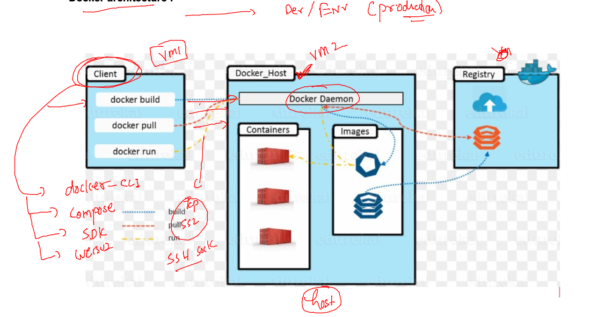
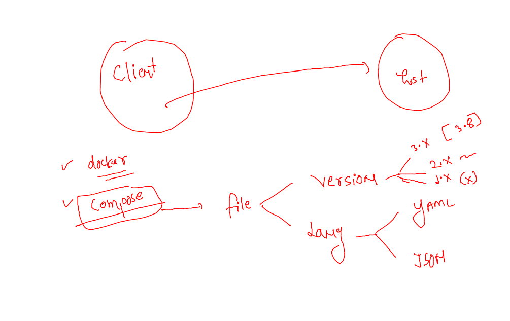

### Revision 


### Implementing None Network in container 

```
[ashu@docker-host ashu-app-images]$ docker run -it  --network none  alpine  sh 
/ # ip a
1: lo: <LOOPBACK,UP,LOWER_UP> mtu 65536 qdisc noqueue state UNKNOWN qlen 1000
    link/loopback 00:00:00:00:00:00 brd 00:00:00:00:00:00
    inet 127.0.0.1/8 scope host lo
       valid_lft forever preferred_lft forever
/ # ifconfig 
lo        Link encap:Local Loopback  
          inet addr:127.0.0.1  Mask:255.0.0.0
          UP LOOPBACK RUNNING  MTU:65536  Metric:1
          RX packets:0 errors:0 dropped:0 overruns:0 frame:0
          TX packets:0 errors:0 dropped:0 overruns:0 carrier:0
          collisions:0 txqueuelen:1000 
          RX bytes:0 (0.0 B)  TX bytes:0 (0.0 B)

/ # ping 172.17.0.1
PING 172.17.0.1 (172.17.0.1): 56 data bytes
ping: sendto: Network unreachable
/ # ping google.com
ping: bad address 'google.com'
/ # exit
```

### creating custom bridge network 

```
[ashu@docker-host ashu-app-images]$ docker  network create   ashubr1 
0ee019b89bb34656674858b1bef77e4c610e07ebc07a6fb39fe3fd143d154c82
[ashu@docker-host ashu-app-images]$ docker  network ls
NETWORK ID     NAME      DRIVER    SCOPE
0ee019b89bb3   ashubr1   bridge    local
38639e995d11   bridge    bridge    local
3372299e537a   host      host      local
dbfa091ea6fa   none      null      local
[ashu@docker-host ashu-app-images]$ docker  network inspect ashubr1
[
    {
        "Name": "ashubr1",
        "Id": "0ee019b89bb34656674858b1bef77e4c610e07ebc07a6fb39fe3fd143d154c82",
        "Created": "2023-02-23T08:46:41.924651537Z",
        "Scope": "local",
        "Driver": "bridge",
        "EnableIPv6": false,
        "IPAM": {
            "Driver": "default",
            "Options": {},
            "Config": [
                {
                    "Subnet": "172.18.0.0/16",
                    "Gateway": "172.18.0.1"
                }
```

### creating containers in network bridge 

```
[ashu@docker-host ashu-app-images]$ docker run -itd --name ashuc1 --network ashubr1  alpine  sleep 1000 
a11f2a165c7fd6b20346ccf87c88088e1d37a171e67ace8d7a25798e0f3edb05
[ashu@docker-host ashu-app-images]$ docker run -itd --name ashuc2 --network ashubr1  alpine  sleep 1000 
592317bd183866eee7183b197c2f264a2c499aef81b5c670a2777948afd6229f
[ashu@docker-host ashu-app-images]$ docker network inspect ashubr1
[
    {
        "Name": "ashubr1",
        "Id": "0ee019b89bb34656674858b1bef77e4c610e07ebc07a6fb39fe3fd143d154c82",
        "Created": "2023-02-23T08:46:41.924651537Z",
        "Scope": "local",
        "Driver": "bridge",
        "EnableIPv6": false,
        "IPAM": {
            "Driver": "default",
            "Options": {},
            "Config": [
                {
                    "Subnet": "172.18.0.0/16",
                    "Gateway": "172.18.0.1"
                }
            ]
        },
        "Internal": false,
        "Attachable": false,
        "Ingress": false,
        "ConfigFrom": {
            "Network": ""
        },
        "ConfigOnly": false,
        "Containers": {
            "592317bd183866eee7183b197c2f264a2c499aef81b5c670a2777948afd6229f": {
                "Name": "ashuc2",
                "EndpointID": "c8613a2c741c33cac3a464e53b0b40e9aed573bc04f00ac46c2f606c20385543",
                "MacAddress": "02:42:ac:12:00:03",
                "IPv4Address": "172.18.0.3/16",
                "IPv6Address": ""
            },
            "a11f2a165c7fd6b20346ccf87c88088e1d37a171e67ace8d7a25798e0f3edb05": {
                "Name": "ashuc1",
                "EndpointID": "7f8a548f13d6ecd3bc867ec0b05ececc2b9b06e90c6f4a3a2553b3ff914f09bf",
                "MacAddress": "02:42:ac:12:00:02",
                "IPv4Address": "172.18.0.2/16",
                "IPv6Address": ""
            }
        },
        "Options": {},
        "Labels": {}
    }
]
```

### testing connections

```
[ashu@docker-host ashu-app-images]$ 
[ashu@docker-host ashu-app-images]$ docker  exec -it ashuc1 sh 
/ # 
/ # ping ashuc2
PING ashuc2 (172.18.0.3): 56 data bytes
64 bytes from 172.18.0.3: seq=0 ttl=64 time=0.094 ms
64 bytes from 172.18.0.3: seq=1 ttl=64 time=0.086 ms
64 bytes from 172.18.0.3: seq=2 ttl=64 time=0.078 ms
^C
--- ashuc2 ping statistics ---
3 packets transmitted, 3 packets received, 0% packet loss
round-trip min/avg/max = 0.078/0.086/0.094 ms
/ # exit
[ashu@docker-host ashu-app-images]$ docker  ps
CONTAINER ID   IMAGE     COMMAND        CREATED          STATUS          PORTS     NAMES
51ee7b230e2e   alpine    "sleep 1000"   30 seconds ago   Up 30 seconds             abdoc2
eefd05fb6d6e   alpine    "sleep 1000"   32 seconds ago   Up 31 seconds             sudarshantc2
8e8b4752b5bc   alpine    "sleep 1000"   38 seconds ago   Up 37 seconds             abdoc1
c855a9a48f8d   alpine    "sleep 1000"   38 seconds ago   Up 37 seconds             sudarshantc1
458415d4c0a4   busybox   "sh"           41 seconds ago   Up 41 seconds             rjamaro-c1
592317bd1838   alpine    "sleep 1000"   2 minutes ago    Up 2 minutes              ashuc2
a11f2a165c7f   alpine    "sleep 1000"   2 minutes ago    Up 2 minutes              ashuc1
[ashu@docker-host ashu-app-images]$ docker  exec -it ashuc1 sh 
/ # 
/ # ping abdoc2
ping: bad address 'abdoc2'
/ # exit
[ashu@docker-host ashu-app-images]$ 
```

### creating specific subnet network bridge 

```
[ashu@docker-host ashu-app-images]$ docker network create  ashubr2  --subnet  192.168.100.0/24  --gateway 192.168.100.1 
```

### creating container network with details 

```
[ashu@docker-host ashu-app-images]$ docker network create ashubr1
fc2963a9935259c30d912ec74a0542ce780cae867ef8ca229dc6d0a7b2749bc5
[ashu@docker-host ashu-app-images]$ docker network create ashubr2 --subnet 192.168.179.0/24  --gateway  192.168.179.1 
242d44c6f461c0fa5595fd9968fe6282b24ef2a4e5b771b73c33fa7054eb8d0c
[ashu@docker-host ashu-app-images]$ 
[ashu@docker-host ashu-app-images]$ docker run -itd --name ashuc1 --network ashubr1  alpine sleep 1000
c89ce796c1afefa13ce920a222eb8b2733c33b75eaf7e66da12a3897edb8174f
[ashu@docker-host ashu-app-images]$ docker run -itd --name ashuc2 --network ashubr1  alpine sleep 1000
6db59091bb30b17d672a302bc2034348de061ed6fa218616dae9cccb42b5f867
[ashu@docker-host ashu-app-images]$ 
[ashu@docker-host ashu-app-images]$ docker run -itd --name ashuc3 --network ashubr2  alpine sleep 1000
71c7473796f57465d30928fbc2897b4a2fb1e46afb57b5d78aa12d7b972d4926
[ashu@docker-host ashu-app-images]$ docker run -itd --name ashuc4 --network ashubr2 --ip 192.168.179.200  alpine sleep 1000
2bc6e7e84986cd523725b19d258dc0a8fdf73274edbd64c3405a5e61d8e29a8b
[ashu@docker-host ashu-app-images]$ docker  exec -it  ashuc4  sh 
/ # ifconfig 
eth0      Link encap:Ethernet  HWaddr 02:42:C0:A8:B3:C8  
          inet addr:192.168.179.200  Bcast:192.168.179.255  Mask:255.255.255.0
          UP BROADCAST RUNNING MULTICAST  MTU:1500  Metric:1
          RX packets:7 errors:0 dropped:0 overruns:0 frame:0
          TX packets:0 errors:0 dropped:0 overruns:0 carrier:0
          collisions:0 txqueuelen:0 
          RX bytes:570 (570.0 B)  TX bytes:0 (0.0 B)

lo        Link encap:Local Loopback  
          inet addr:127.0.0.1  Mask:255.0.0.0
          UP LOOPBACK RUNNING  MTU:65536  Metric:1
          RX packets:0 errors:0 dropped:0 overruns:0 frame:0
          TX packets:0 errors:0 dropped:0 overruns:0 carrier:0
          collisions:0 txqueuelen:1000 
          RX bytes:0 (0.0 B)  TX bytes:0 (0.0 B)

/ # exit
[ashu@docker-host ashu-app-images]$ 
```

### adding multiple interface to the network container 

```
[ashu@docker-host ashu-app-images]$ docker  exec -it  ashuc1  sh 
/ # ifconfig 
eth0      Link encap:Ethernet  HWaddr 02:42:C0:A8:50:02  
          inet addr:192.168.80.2  Bcast:192.168.95.255  Mask:255.255.240.0
          UP BROADCAST RUNNING MULTICAST  MTU:1500  Metric:1
          RX packets:24 errors:0 dropped:0 overruns:0 frame:0
          TX packets:9 errors:0 dropped:0 overruns:0 carrier:0
          collisions:0 txqueuelen:0 
          RX bytes:2120 (2.0 KiB)  TX bytes:530 (530.0 B)

lo        Link encap:Local Loopback  
          inet addr:127.0.0.1  Mask:255.0.0.0
          UP LOOPBACK RUNNING  MTU:65536  Metric:1
          RX packets:12 errors:0 dropped:0 overruns:0 frame:0
          TX packets:12 errors:0 dropped:0 overruns:0 carrier:0
          collisions:0 txqueuelen:1000 
          RX bytes:946 (946.0 B)  TX bytes:946 (946.0 B)

/ # 
[ashu@docker-host ashu-app-images]$ docker network connect  ashubr2  ashuc1 
[ashu@docker-host ashu-app-images]$ docker  exec -it  ashuc1  sh 
/ # ifconfig 
eth0      Link encap:Ethernet  HWaddr 02:42:C0:A8:50:02  
          inet addr:192.168.80.2  Bcast:192.168.95.255  Mask:255.255.240.0
          UP BROADCAST RUNNING MULTICAST  MTU:1500  Metric:1
          RX packets:24 errors:0 dropped:0 overruns:0 frame:0
          TX packets:9 errors:0 dropped:0 overruns:0 carrier:0
          collisions:0 txqueuelen:0 
          RX bytes:2120 (2.0 KiB)  TX bytes:530 (530.0 B)

eth1      Link encap:Ethernet  HWaddr 02:42:C0:A8:B3:03  
          inet addr:192.168.179.3  Bcast:192.168.179.255  Mask:255.255.255.0
          UP BROADCAST RUNNING MULTICAST  MTU:1500  Metric:1
          RX packets:6 errors:0 dropped:0 overruns:0 frame:0
          TX packets:0 errors:0 dropped:0 overruns:0 carrier:0
          collisions:0 txqueuelen:0 
          RX bytes:500 (500.0 B)  TX bytes:0 (0.0 B)

lo        Link encap:Local Loopback  
          inet addr:127.0.0.1  Mask:255.0.0.0
          UP LOOPBACK RUNNING  MTU:65536  Metric:1
          RX packets:12 errors:0 dropped:0 overruns:0 frame:0
          TX packets:12 errors:0 dropped:0 overruns:0 carrier:0
          collisions:0 txqueuelen:1000 
          RX bytes:946 (946.0 B)  TX bytes:946 (946.0 B)

/ # 
[ashu@docker-host ashu-app-images]$ docker  exec -it  ashuc1  sh 
/ # ping ashuc4
PING ashuc4 (192.168.179.200): 56 data bytes
64 bytes from 192.168.179.200: seq=0 ttl=64 time=0.111 ms
64 bytes from 192.168.179.200: seq=1 ttl=64 time=0.089 ms
^C
--- ashuc4 ping statistics ---
2 packets transmitted, 2 packets received, 0% packet loss
round-trip min/avg/max = 0.089/0.100/0.111 ms
/ # 
```

### disconnect

```
[ashu@docker-host ashu-app-images]$ docker network disconnect  ashubr2  ashuc1 
[ashu@docker-host ashu-app-images]$ 
[ashu@docker-host ashu-app-images]$ docker  exec -it  ashuc1  sh 
/ # ping ashuc4
ping: bad address 'ashuc4'
/ # 
```

### Docker client options 



### stopping docker service to act this machine as docker client 

```
[root@docker-client-machine ~]# systemctl stop docker 
Warning: Stopping docker.service, but it can still be activated by:
  docker.socket
[root@docker-client-machine ~]# systemctl disable docker 
Removed symlink /etc/systemd/system/multi-user.target.wants/docker.service.
[root@docker-client-machine ~]# systemctl disable docker.socket 
[root@docker-client-machine ~]# systemctl stop  docker.socket 
```

### installing and configuring docker server 

```
[root@docker-server ~]# history 
    1  hostnamectl set-hostname docker-server
    2  docker
    3  yum install docker -y
    4  history 
[root@docker-server ~]# cd  /etc/sysconfig/
[root@docker-server sysconfig]# ls
acpid       clock     docker          irqbalance  netconsole       raid-check     rpcbind    selinux
atd         console   docker-storage  keyboard    network          rdisc          rsyncd     sshd
authconfig  cpupower  i18n            man-db      network-scripts  readonly-root  rsyslog    sysstat
chronyd     crond     init            modules     nfs              rpc-rquotad    run-parts  sysstat.ioconf
[root@docker-server sysconfig]# vim docker
[root@docker-server sysconfig]# 
[root@docker-server sysconfig]# cat docker
# The max number of open files for the daemon itself, and all
# running containers.  The default value of 1048576 mirrors the value
# used by the systemd service unit.
DAEMON_MAXFILES=1048576

# Additional startup options for the Docker daemon, for example:
# OPTIONS="--ip-forward=true --iptables=true"
# By default we limit the number of open files per container
OPTIONS="--default-ulimit nofile=32768:65536  -H tcp://172.31.43.41:2375"

# How many seconds the sysvinit script waits for the pidfile to appear
# when starting the daemon.
DAEMON_PIDFILE_TIMEOUT=10

```

### starting docker service 

```
[root@docker-server sysconfig]# systemctl start docker 
[root@docker-server sysconfig]# systemctl status docker 
● docker.service - Docker Application Container Engine
   Loaded: loaded (/usr/lib/systemd/system/docker.service; disabled; vendor preset: disabled)
   Active: active (running) since Thu 2023-02-23 09:54:10 UTC; 7s ago
     Docs: https://docs.docker.com
  Process: 3721 ExecStartPre=/usr/libexec/docker/docker-setup-runtimes.sh (code=exited, status=0/SUCCESS)
  Process: 3719 ExecStartPre=/bin/mkdir -p /run/docker (code=exited, status=0/SUCCESS)
 Main PID: 3724 (dockerd)
```

### from docker client machine we can send request to docker server 

### method 1

```
[ashu@docker-client-machine ashu-app-images]$ docker -H  tcp://172.31.43.41:2375   network ls 
NETWORK ID     NAME      DRIVER    SCOPE
4ff441604725   bridge    bridge    local
4fa0cd8b9029   host      host      local
300dcde93a24   none      null      local
[ashu@docker-client-machine ashu-app-images]$ 
[ashu@docker-client-machine ashu-app-images]$ docker -H  tcp://172.31.43.41:2375   images
REPOSITORY   TAG       IMAGE ID   CREATED   SIZE
[ashu@docker-client-machine ashu-app-images]$ 
```

### method 2

```
[ashu@docker-client-machine ashu-app-images]$ docker  context  create  remote-server  --docker host="tcp://172.31.43.41:2375"
remote-server
Successfully created context "remote-server"
[ashu@docker-client-machine ashu-app-images]$ 
[ashu@docker-client-machine ashu-app-images]$ docker  context  ls
NAME            DESCRIPTION                               DOCKER ENDPOINT               KUBERNETES ENDPOINT   ORCHESTRATOR
default *       Current DOCKER_HOST based configuration   unix:///var/run/docker.sock                         swarm
remote-server                                             tcp://172.31.43.41:2375                             
[ashu@docker-client-machine ashu-app-images]$ 
[ashu@docker-client-machine ashu-app-images]$ docker images
Cannot connect to the Docker daemon at unix:///var/run/docker.sock. Is the docker daemon running?
[ashu@docker-client-machine ashu-app-images]$ 
[ashu@docker-client-machine ashu-app-images]$ docker  context  use  remote-server 
remote-server
Current context is now "remote-server"
[ashu@docker-client-machine ashu-app-images]$ docker  context  ls
NAME              DESCRIPTION                               DOCKER ENDPOINT               KUBERNETES ENDPOINT   ORCHESTRATOR
default           Current DOCKER_HOST based configuration   unix:///var/run/docker.sock                         swarm
remote-server *                                             tcp://172.31.43.41:2375                             
[ashu@docker-client-machine ashu-app-images]$ docker images
REPOSITORY   TAG       IMAGE ID   CREATED   SIZE
[ashu@docker-client-machine ashu-app-images]$ 
```

### Installing docker-compose on docker-client machien 

```
[root@docker-client-machine ~]# curl -SL https://github.com/docker/compose/releases/download/v2.16.0/docker-compose-linux-x86_64 -o /usr/bin/docker-compose 
  % Total    % Received % Xferd  Average Speed   Time    Time     Time  Current
                                 Dload  Upload   Total   Spent    Left  Speed
  0     0    0     0    0     0      0      0 --:--:-- --:--:-- --:--:--     0
100 45.4M  100 45.4M    0     0  4799k      0  0:00:09  0:00:09 --:--:-- 5169k
[root@docker-client-machine ~]# 
[root@docker-client-machine ~]# 
[root@docker-client-machine ~]# chmod +x /usr/bin/docker-compose 
[root@docker-client-machine ~]# 
[root@docker-client-machine ~]# docker-compose  version
Docker Compose version v2.16.0
[root@docker-client-machine ~]# 


```

### more info about docker-compose 



### compose example 1 

```
version:  '3.8' # compose file version 
services:
  ashu-app-ui: # name of service 
    image: nginx:1.12 # image from docker hub if not present local on docker server
    container_name: ashuc1 # name of container  
    ports: # port mapping 
    - 1234:80 
```

### lets run it 

```
[ashu@docker-client-machine ashu-app-images]$ ls
java-code  python-code  webapp
[ashu@docker-client-machine ashu-app-images]$ mkdir ashu-compose
[ashu@docker-client-machine ashu-app-images]$ ls
ashu-compose  java-code  python-code  webapp
[ashu@docker-client-machine ashu-app-images]$ cd  ashu-compose/
[ashu@docker-client-machine ashu-compose]$ ls
docker-compose.yaml
[ashu@docker-client-machine ashu-compose]$ docker-compose up -d
[+] Running 4/4
 ⠿ ashu-app-ui Pulled                                                                                                                                     5.8s
   ⠿ f2aa67a397c4 Pull complete                                                                                                                           2.1s
   ⠿ e3eaf3d87fe0 Pull complete                                                                                                                           2.8s
   ⠿ 38cb13c1e4c9 Pull complete                                                                                                                           2.8s
[+] Running 2/2
 ⠿ Network ashu-compose_default  Created                                                                                                                  0.0s
 ⠿ Container ashuc1              Started                                                                                                                  0.9s
[ashu@docker-client-machine ashu-compose]$ docker-compose ps
NAME                IMAGE               COMMAND                  SERVICE             CREATED             STATUS              PORTS
ashuc1              nginx:1.12          "nginx -g 'daemon of…"   ashu-app-ui         13 seconds ago      Up 12 seconds       0.0.0.0:1234->80/tcp, :::1234->80/tcp
[ashu@docker-client-machine ashu-compose]$
```


