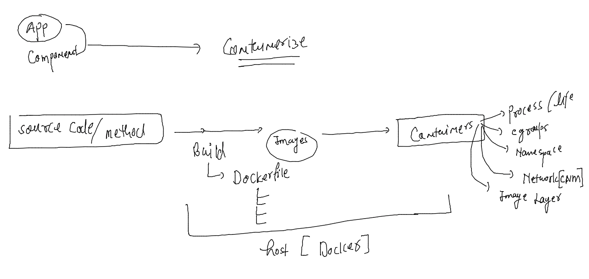

### Revision 



### Implementing None Network in container 

```
[ashu@docker-host ashu-app-images]$ docker run -it  --network none  alpine  sh 
/ # ip a
1: lo: <LOOPBACK,UP,LOWER_UP> mtu 65536 qdisc noqueue state UNKNOWN qlen 1000
    link/loopback 00:00:00:00:00:00 brd 00:00:00:00:00:00
    inet 127.0.0.1/8 scope host lo
       valid_lft forever preferred_lft forever
/ # ifconfig 
lo        Link encap:Local Loopback  
          inet addr:127.0.0.1  Mask:255.0.0.0
          UP LOOPBACK RUNNING  MTU:65536  Metric:1
          RX packets:0 errors:0 dropped:0 overruns:0 frame:0
          TX packets:0 errors:0 dropped:0 overruns:0 carrier:0
          collisions:0 txqueuelen:1000 
          RX bytes:0 (0.0 B)  TX bytes:0 (0.0 B)

/ # ping 172.17.0.1
PING 172.17.0.1 (172.17.0.1): 56 data bytes
ping: sendto: Network unreachable
/ # ping google.com
ping: bad address 'google.com'
/ # exit
```

