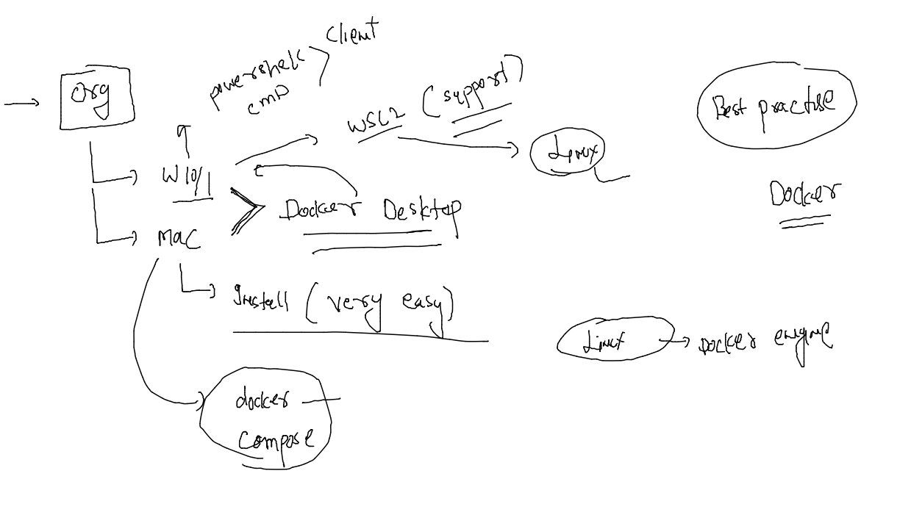
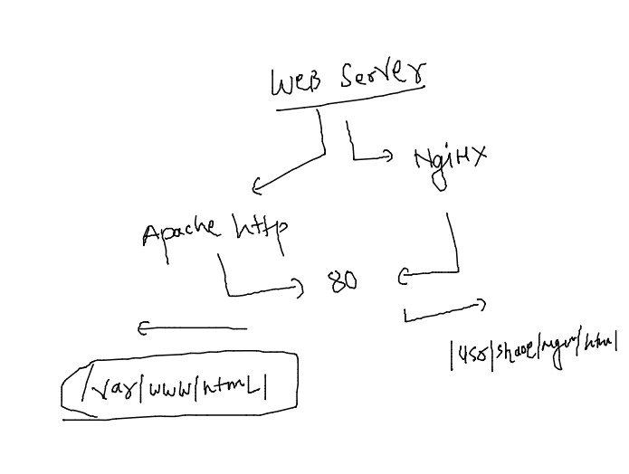

### For testing or practise you can use docker Desktop on Mac / windows pc 

### note: above setup will be creating only linux based containers 



### Customer story with docker container 

### cloning 3 webapps

```
385  git clone https://github.com/yenchiah/project-website-template.git
  386  ls
  387  git clone https://github.com/schoolofdevops/html-sample-app.git
  388  ls
  389  git clone https://github.com/microsoft/project-html-website.git
  390  ls
```

### checking 

```
ashu@docker-client-machine ashu-customer]$ ls 
html-sample-app  project-html-website  project-website-template
```

### Understanding apache httpd webserver



### shell script to run by container 

```
#!/bin/bash 

if  [  "$deploy" == "ui1" ]
then
    cp -rf /apps/app1/*  /var/www/html/
    httpd -DFOREGROUND 

elif  [  "$deploy" == "ui2" ]
then
    cp -rf  /apps/app2/*  /var/www/html/
    httpd -DFOREGROUND
    
elif  [  "$deploy" == "ui3" ]
then
    cp -rf  /apps/app3/*  /var/www/html/
    httpd -DFOREGROUND
else 
    echo "You have not passed Right variable .." >/var/www/html/index.html
    httpd -DFOREGROUND
fi 
```

### Dockerfile content 

```
FROM oraclelinux:8.5 
LABEL name=ashutoshh
LABEL   email=ashutoshh@linux.com 
ENV     deploy=myui
# setting env variable in dockerfile with some default value 
RUN yum install httpd -y 
RUN mkdir /apps /apps/app1 /apps/app2 /apps/app3 
ADD html-sample-app /apps/app1/
COPY project-html-website /apps/app2/
ADD project-website-template /apps/app3/
COPY host.sh /apps/
WORKDIR /apps
RUN chmod +x host.sh 
ENTRYPOINT ["./host.sh"]
# CMD / ENTRYPOINT -- they are designed to fix default process of docker container 
```

### Docker-compose 

```
version:  '3.8'
networks: # creating custom bridge 
  ashubr001: # name of bridge 
services: # to deal with services 
  ashu-customer-app:
    image: ashu-customer:appv1 
    build: # to build image 
      context: . # location of dockerfile 
      Dockerfile: Dockerfile # name of dockerfile
    container_name: ashuc-ui2 
    environment: # passing Env variable and its value 
      deploy: "ui2"
    networks: # to use network we created above
    - ashubr001 # name of netowrk 
    ports:
    - 1234:80 
```

### lets run it 

```
[ashu@docker-client-machine ashu-customer]$ docker-compose  -f customer.yaml  up -d --build 
[+] Building 11.0s (4/13)                                                                                                                    
 => [internal] load build definition from Dockerfile                                                                                    0.0s
 => => transferring dockerfile: 550B                                                                                                    0.0s
 => [internal] load .dockerignore                                                                                                       0.0s
 => => transferring context: 2B                                                                                                         0.0s
 => [internal] load metadata for docker.io/library/oraclelinux:8.5                                                                      2.4s
 => [1/9] FROM docker.io/library/oraclelinux:8.5@sha256:cda8334297e86456c96986b4070891ed58f56151e8ae2e500d9e13b1d743b2c6                8.4s
 => => resolve docker.io/library/oraclelinux:8.5@sha256:cda8334297e86456c96986b4070891ed58f56151e8ae2e500d9e13b1d743b2c6                0.0s
 => => sha256:cda8334297e86456c96986b4070891ed58f56151e8ae2e500d9e13b1d743b2c6 547B / 547B                                              0.0s
 => => sha256:3cadd263e7744a34daa274f6d95e621b1c06a15aa34d2ede3ef6798ad77bac3b 529B / 529B                                              0.0s
 => => sha256:bbfaaa4ae0740f0edf1ded0237637a09e2dbbc40299f0bd4209064ccae0581ef 1.48kB / 1.48kB                                          0.0s
 => => sha256:42405d186b2e7939aa51dc1bcc0f4cf0ce1236f4d6e38f2fae9822c41e98078e 87.48MB / 87.48MB                                        2.0s
 => => extracting sha256:42405d186b2e7939aa51dc1bcc0f4cf0ce1236f4d6e38f2fae9822c41e98078e                                               6.2s
 => [internal] load build context                                                                                                       0.3s
 => => transferring context: 8.37MB                                                                                                     0.2s

```

### checking it

```
402  docker-compose  -f customer.yaml  up -d --build 
  403  docker-compose  -f customer.yaml  ps
```

### using build and compose 

```
version:  '3.8'
networks: # creating custom bridge 
  ashubr001: # name of bridge 
services: # to deal with services 
  ashu-customer-app:
    image: ashu-customer:appv1 
    build: # to build image 
      context: . # location of dockerfile 
      dockerfile: Dockerfile # name of dockerfile
    container_name: ashuc-ui2 
    environment: # passing Env variable and its value 
      deploy: "ui2"
    networks: # to use network we created above
    - ashubr001 # name of netowrk 
    ports:
    - 1234:80 
  ashu-customer-app2:
    image: ashu-customer:appv1
    container_name: ashu-ui3
    environment:
      deploy: "ui3"
    ports:
    - 1188:80 
    networks:
    - ashubr001 
```

### java code 

```
class ashu { 
    public static void main(String args[]) 
    { 
        // test expression 
        while (true) { 
            System.out.println("Hello World"); 
            try {
                Thread.sleep(2000);
            } catch (Exception ex) {
                // Ignored
            }
  
            // update expression 
        } 
    } 
} 
```


### Dockerfile 

```
FROM openjdk
LABEL name=ashutoshh
RUN mkdir /code
COPY ashu.java /code/
WORKDIR /code
RUN javac ashu.java 
# above step for compiling 
CMD ["java","ashu"]
```

### building image 

```
422  docker build -t ashujava:v1 . 
  423  history 
  424  docker run -itd --name ashut1 ashujava:v1 
  425  docker ps
  426  docker logs  ashut1 
```

### java spring boot webapp

```
[ashu@docker-client-machine ashu-app-images]$ mkdir  ashu-java-spring
[ashu@docker-client-machine ashu-app-images]$ ls
ashu-compose  ashu-customer  ashu-java-spring  java-code  python-code  webapp
[ashu@docker-client-machine ashu-app-images]$ cd ashu-java-spring/
[ashu@docker-client-machine ashu-java-spring]$ git clone https://github.com/redashu/java-springboot.git
Cloning into 'java-springboot'...
remote: Enumerating objects: 23, done.
remote: Counting objects: 100% (23/23), done.
remote: Compressing objects: 100% (17/17), done.
remote: Total 23 (delta 4), reused 0 (delta 0), pack-reused 0
Receiving objects: 100% (23/23), 5.62 KiB | 5.62 MiB/s, done.
Resolving deltas: 100% (4/4), done.
[ashu@docker-client-machine ashu-java-spring]$ ls
java-springboot
[ashu@docker-client-machine ashu-java-spring]$ 

```
### Multi-stage Dockerfile 

```
FROM oraclelinux:8.4 as ashu-app-builder 
LABEL   name=ashutoshh
RUN yum install maven java-1.8.0-openjdk.x86_64 java-1.8.0-openjdk-devel.x86_64  -y 
RUN mkdir /newcode 
ADD java-springboot /newcode/
WORKDIR /newcode
RUN mvn clean package
# it will build spring boot app --.war file  /newcode/target/WebApp.war 
FROM tomcat 
LABEL email=ashutoshh@linux.com 
COPY --from=ashu-app-builder /newcode/target/WebApp.war /usr/local/tomcat/webapps/

```

### lets build and create 

```
446  docker build -t  ashufinal:v1 .
  447  history 
  448  docker run -itd --name ashujc1 -p 1166:8080 ashufinal:v1 
```


