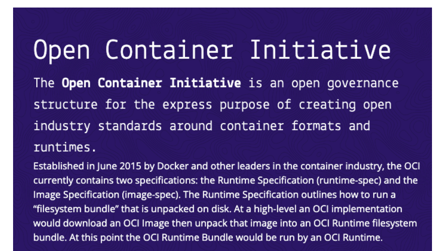
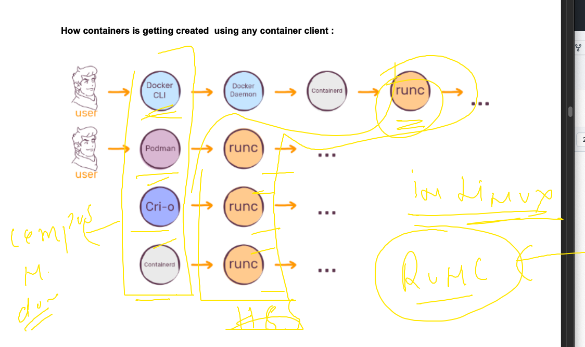
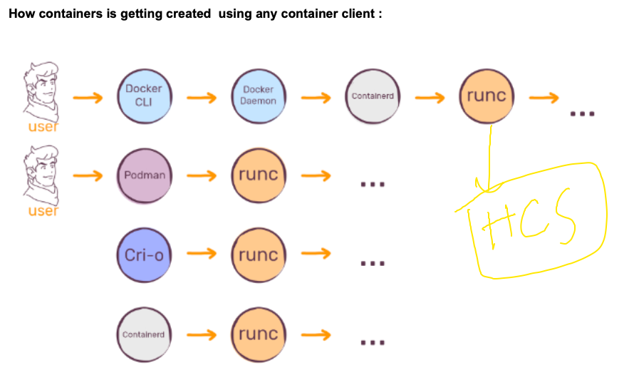
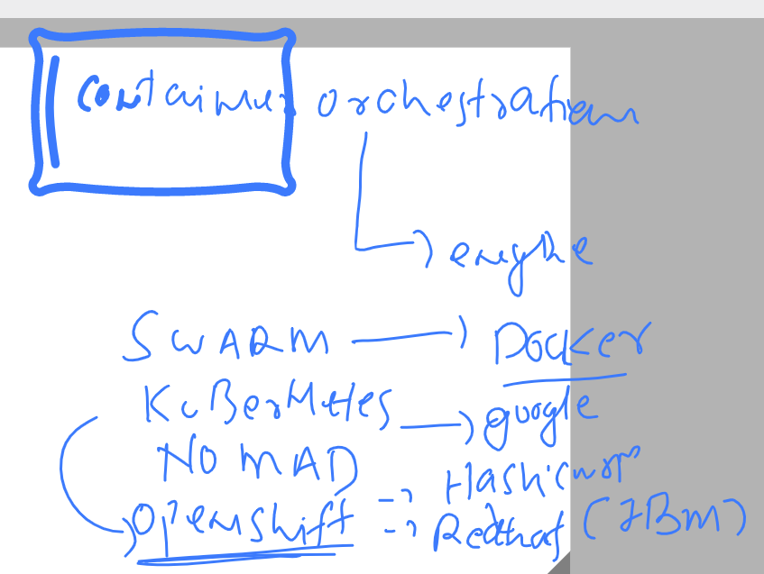
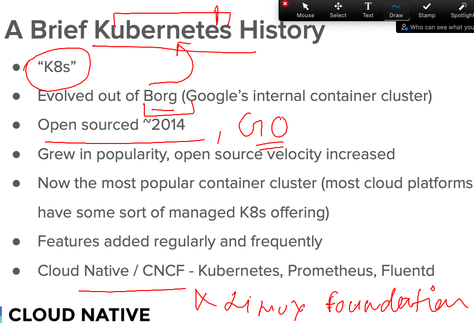
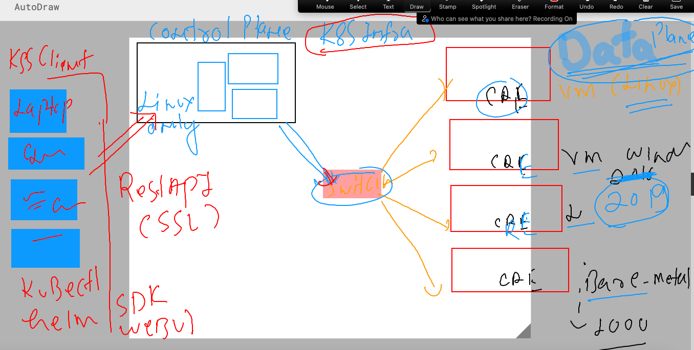
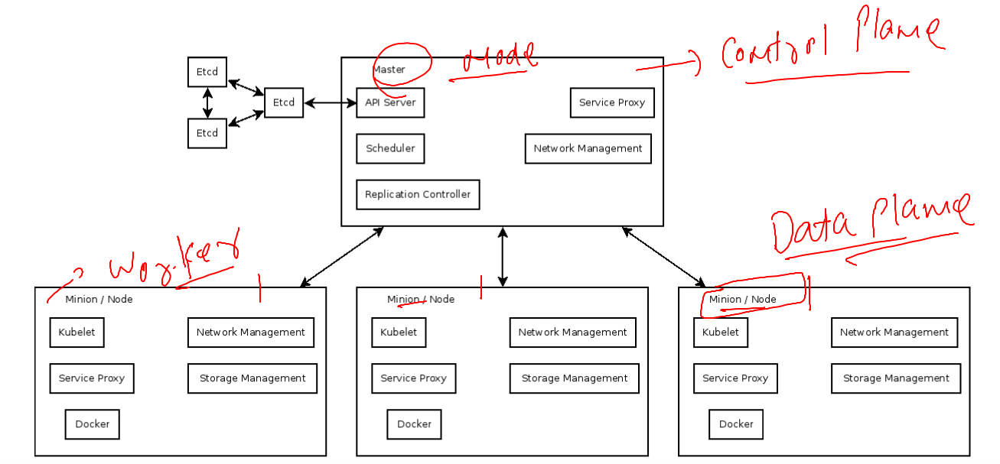

## REvision 

### OCI for container images



### reality of container services 



### Host compute service in Windows for container 



### Introduction to container orchestration engines 



### Introduction to k8s 



#### k8s architecture 



### k8s more terminology 



## Kubectl is k8s client side software to interact with k8s cluster 

### we can install this in any OS like -- windows /mac / linux 

### installing on linux based client 

```
[root@docker-k8s-client ~]# curl -LO "https://dl.k8s.io/release/$(curl -L -s https://dl.k8s.io/release/stable.txt)/bin/linux/amd64/kubectl"
  % Total    % Received % Xferd  Average Speed   Time    Time     Time  Current
                                 Dload  Upload   Total   Spent    Left  Speed
100   138  100   138    0     0    278      0 --:--:-- --:--:-- --:--:--   278
100 45.7M  100 45.7M    0     0  31.5M      0  0:00:01  0:00:01 --:--:--  105M
[root@docker-k8s-client ~]# ls
kubectl  users.txt
[root@docker-k8s-client ~]# mv kubectl /usr/bin/
[root@docker-k8s-client ~]# chmod +x /usr/bin/kubectl 
[root@docker-k8s-client ~]# 

```

### verify from cli

```
[ashu@docker-k8s-client ashu-app-images]$ kubectl  version --client 
WARNING: This version information is deprecated and will be replaced with the output from kubectl version --short.  Use --output=yaml|json to get the full version.
Client Version: version.Info{Major:"1", Minor:"26", GitVersion:"v1.26.1", GitCommit:"8f94681cd294aa8cfd3407b8191f6c70214973a4", GitTreeState:"clean", BuildDate:"2023-01-18T15:58:16Z", GoVersion:"go1.19.5", Compiler:"gc", Platform:"linux/amd64"}
Kustomize Version: v4.5.7
[ashu@docker-k8s-client 
```


