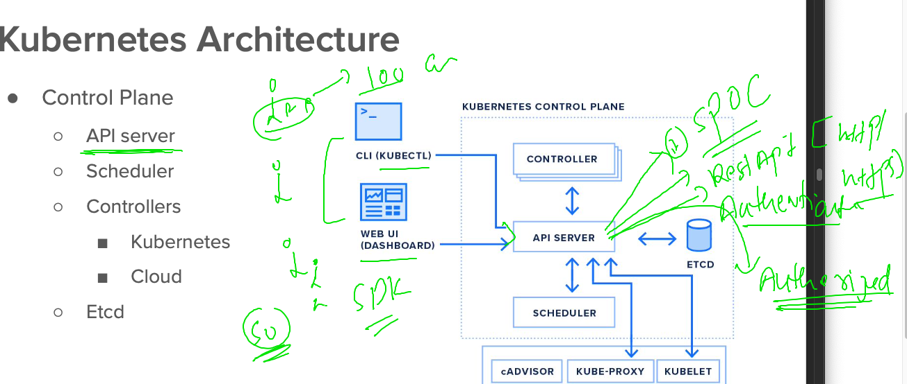
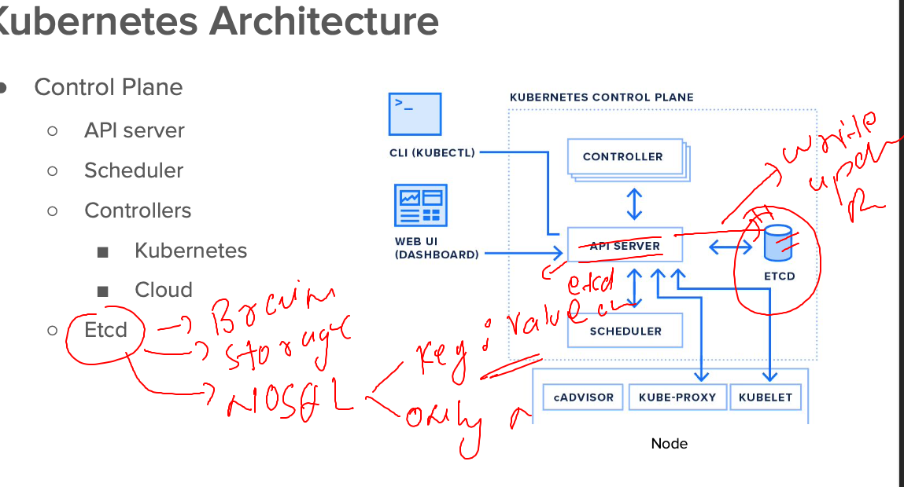

## REvision 

### OCI for container images


### reality of container services 


### Host compute service in Windows for container 


### Introduction to container orchestration engines 


### Introduction to k8s 


#### k8s architecture 


### k8s more terminology 


## Kubectl is k8s client side software to interact with k8s cluster 

### we can install this in any OS like -- windows /mac / linux 

### installing on linux based client 

```
[root@docker-k8s-client ~]# curl -LO "https://dl.k8s.io/release/$(curl -L -s https://dl.k8s.io/release/stable.txt)/bin/linux/amd64/kubectl"
  % Total    % Received % Xferd  Average Speed   Time    Time     Time  Current
                                 Dload  Upload   Total   Spent    Left  Speed
100   138  100   138    0     0    278      0 --:--:-- --:--:-- --:--:--   278
100 45.7M  100 45.7M    0     0  31.5M      0  0:00:01  0:00:01 --:--:--  105M
[root@docker-k8s-client ~]# ls
kubectl  users.txt
[root@docker-k8s-client ~]# mv kubectl /usr/bin/
[root@docker-k8s-client ~]# chmod +x /usr/bin/kubectl 
[root@docker-k8s-client ~]# 

```

### verify from cli

```
[ashu@docker-k8s-client ashu-app-images]$ kubectl  version --client 
WARNING: This version information is deprecated and will be replaced with the output from kubectl version --short.  Use --output=yaml|json to get the full version.
Client Version: version.Info{Major:"1", Minor:"26", GitVersion:"v1.26.1", GitCommit:"8f94681cd294aa8cfd3407b8191f6c70214973a4", GitTreeState:"clean", BuildDate:"2023-01-18T15:58:16Z", GoVersion:"go1.19.5", Compiler:"gc", Platform:"linux/amd64"}
Kustomize Version: v4.5.7
[ashu@docker-k8s-client 
```

## Understanding internal architecture of k8s -- control plane 

### api-server in control plane 



### Etcd on control 



### OPtions for installing / setup  k8s cluster 


### k8s master node auth file is admin.conf 

```
[root@control-plane ~]# cd  /etc/kubernetes/
[root@control-plane kubernetes]# l
-bash: l: command not found
[root@control-plane kubernetes]# ls
admin.conf  controller-manager.conf  kubelet.conf  manifests  pki  scheduler.conf
[root@control-plane kubernetes]# 
[root@control-plane kubernetes]# cd  manifests/
[root@control-plane manifests]# ls
etcd.yaml  kube-apiserver.yaml  kube-controller-manager.yaml  kube-scheduler.yaml
[root@control-plane manifests]# 


```

### sending request to api server 

```
[ashu@ip-172-31-29-207 ashu-app-images]$ kubectl  cluster-info --kubeconfig  admin.conf 
Kubernetes control plane is running at https://172.31.81.217:6443
CoreDNS is running at https://172.31.81.217:6443/api/v1/namespaces/kube-system/services/kube-dns:dns/proxy

To further debug and diagnose cluster problems, use 'kubectl cluster-info dump'.
[ashu@ip-172-31-29-207 ashu-app-images]$ 
[ashu@ip-172-31-29-207 ashu-app-images]$ kubectl  get  nodes   --kubeconfig  admin.conf 
NAME            STATUS   ROLES                  AGE   VERSION
control-plane   Ready    control-plane,master   13d   v1.23.16
node1           Ready    <none>                 13d   v1.23.16
node3           Ready    <none>                 13d   v1.23.16
```

### copy/moving file to right location 

```
[ashu@ip-172-31-29-207 ashu-app-images]$ mv admin.conf  ~/.kube/config 
[ashu@ip-172-31-29-207 ashu-app-images]$ 
[ashu@ip-172-31-29-207 ashu-app-images]$ 
[ashu@ip-172-31-29-207 ashu-app-images]$ 
[ashu@ip-172-31-29-207 ashu-app-images]$ kubectl  get  nodes
NAME            STATUS   ROLES                  AGE   VERSION
control-plane   Ready    control-plane,master   13d   v1.23.16
node1           Ready    <none>                 13d   v1.23.16
node3           Ready    <none>                 13d   v1.23.16
[ashu@ip-172-31-29-207 ashu-app-images]$ kubectl  cluster-info 
Kubernetes control plane is running at https://172.31.81.217:6443
CoreDNS is running at https://172.31.81.217:6443/api/v1/namespaces/kube-system/services/kube-dns:dns/proxy

To further debug and diagnose cluster problems, use 'kubectl cluster-info dump'.
[ashu@ip-172-31-29-207 ashu-app-images]$ 

```

### Introduction to Pod 


### Pod can have more than one containers 


### First sample Pod YAML file 

```
apiVersion: v1 # apiVersion for sending request 
kind: Pod # related to Pod 
metadata: # name of kind 
  name: ashu-pod123 # name of pod 
spec: # more info about Pod components 
  containers:
  - name: ashuc1 # name of contianer 
    image: docker.io/dockerashu/ashu-ui:mobiv1 # image from Dockerhub  
    ports:
    - containerPort: 80  # port of application container 
```


### lets deploy pod file 

```
[ashu@ip-172-31-29-207 k8s-app-deploy]$ kubectl   get  nodes
NAME            STATUS   ROLES                  AGE   VERSION
control-plane   Ready    control-plane,master   13d   v1.23.16
node1           Ready    <none>                 13d   v1.23.16
node3           Ready    <none>                 13d   v1.23.16
[ashu@ip-172-31-29-207 k8s-app-deploy]$ 
[ashu@ip-172-31-29-207 k8s-app-deploy]$ kubectl   get  pods
No resources found in default namespace.
[ashu@ip-172-31-29-207 k8s-app-deploy]$ ls
ashupod1.yaml
[ashu@ip-172-31-29-207 k8s-app-deploy]$ kubectl  create  -f  ashupod1.yaml 
pod/ashu-pod123 created
[ashu@ip-172-31-29-207 k8s-app-deploy]$ kubectl   get  pods
NAME          READY   STATUS    RESTARTS   AGE
ashu-pod123   1/1     Running   0          11s
[ashu@ip-172-31-29-207 k8s-app-deploy]$ kubectl   get  pods -o wide
NAME          READY   STATUS    RESTARTS   AGE   IP                NODE    NOMINATED NODE   READINESS GATES
ashu-pod123   1/1     Running   0          16s   192.168.166.148   node1   <none>           <none>
[ashu@ip-172-31-29-207 k8s-app-deploy]$ 

```

### sending delete request to pod 

```
[ashu@ip-172-31-29-207 k8s-app-deploy]$ ls
ashupod1.yaml
[ashu@ip-172-31-29-207 k8s-app-deploy]$ kubectl delete -f  ashupod1.yaml 
pod "ashu-pod123" deleted
[ashu@ip-172-31-29-207 k8s-app-deploy]$ kubectl   get  pods
NAME                  READY   STATUS    RESTARTS   AGE
hhalkhazragy-pod123   1/1     Running   0          6m5s
ihor-pod123           1/1     Running   0          5m41s
mfarag-pod123         1/1     Running   0          5m19s
rjamaro-pod123        1/1     Running   0          4m54s
[ashu@ip-172-31-29-207 k8s-app-deploy]$ 

```

### deletion

```
[ashu@ip-172-31-29-207 k8s-app-deploy]$ kubectl  get  pods
NAME             READY   STATUS    RESTARTS   AGE
ihor-pod123      1/1     Running   0          7m25s
mfarag-pod123    1/1     Running   0          7m3s
rjamaro-pod123   1/1     Running   0          6m38s
[ashu@ip-172-31-29-207 k8s-app-deploy]$ 
[ashu@ip-172-31-29-207 k8s-app-deploy]$ kubectl  delete pods ihor-pod123 
pod "ihor-pod123" deleted
[ashu@ip-172-31-29-207 k8s-app-deploy]$ kubectl   get  pods
NAME             READY   STATUS    RESTARTS   AGE
mfarag-pod123    1/1     Running   0          7m15s
rjamaro-pod123   1/1     Running   0          6m50s
[ashu@ip-172-31-29-207 k8s-app-deploy]$ 
```


