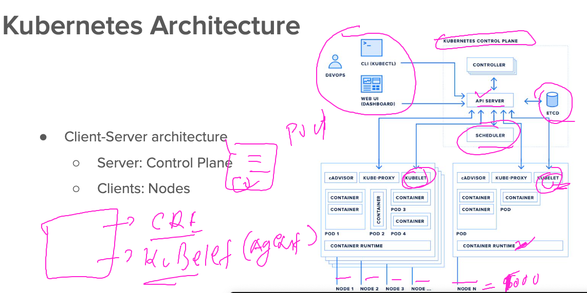
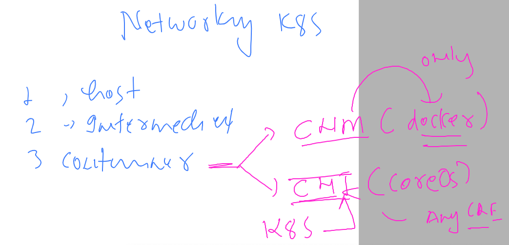
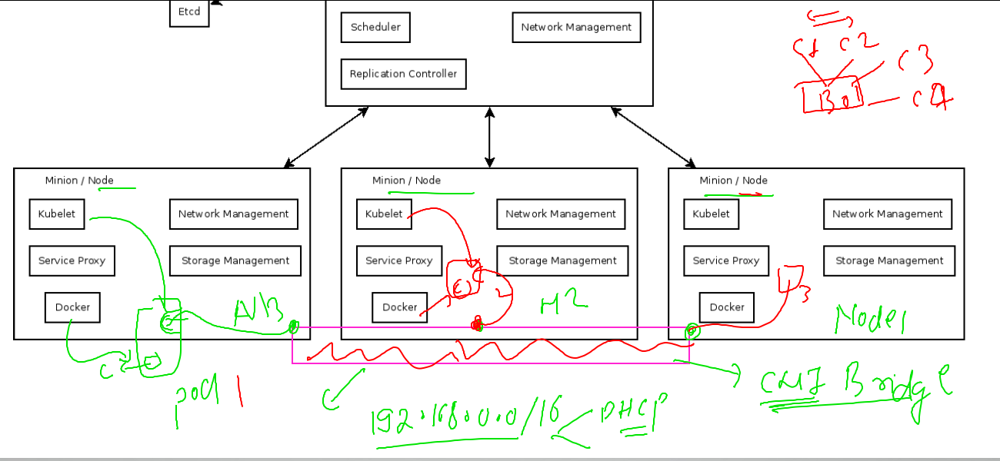
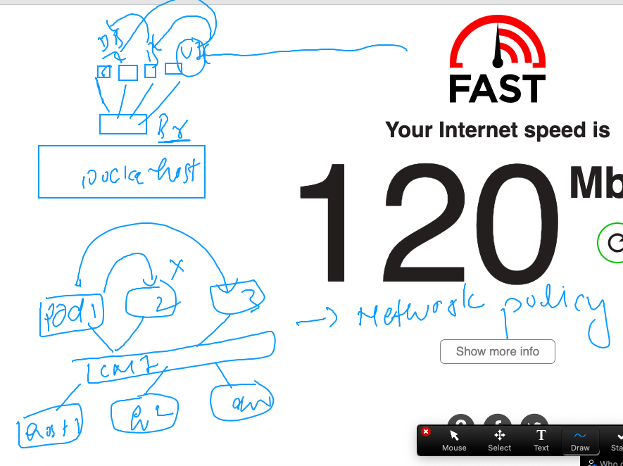
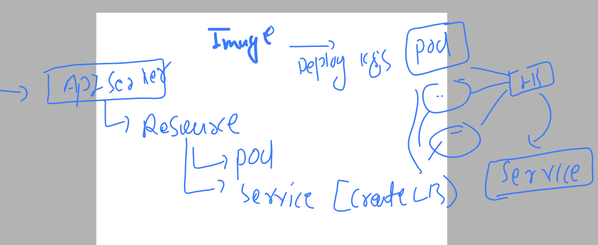
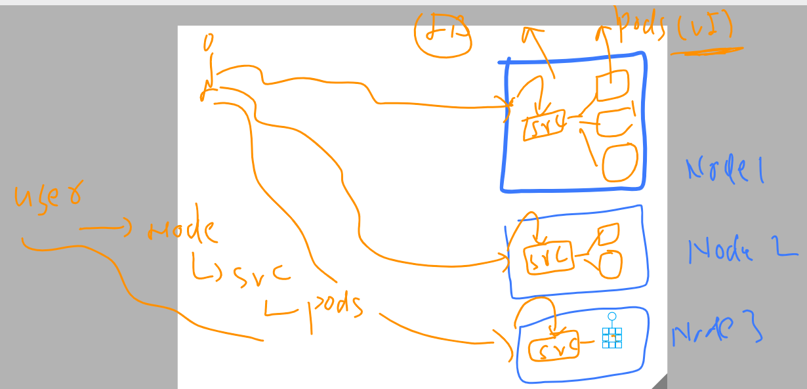
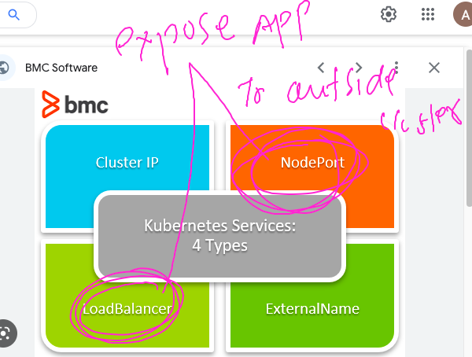
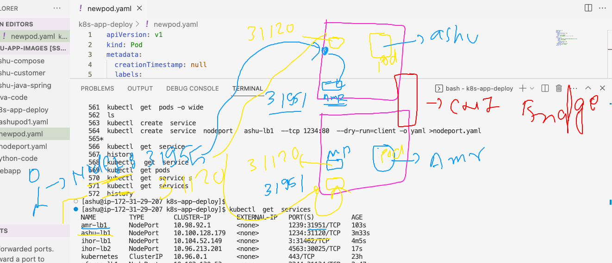
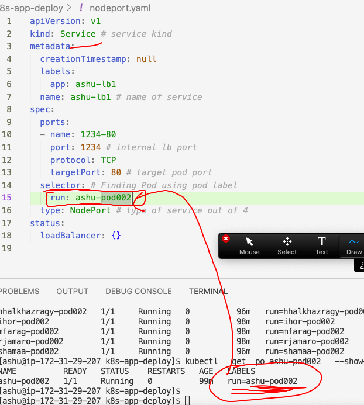

## getting started

### Revision 



### deleting all the pods 

```
ashu@ip-172-31-29-207 ashu-app-images]$ kubectl  delete pods --all
pod "amr-pod002" deleted
pod "ihor-pod002" deleted
pod "mfarag-pod002" deleted
pod "rjamaro-pod002" deleted
pod "rjamaro-pod123" deleted
```

### k8s gonna use CNI for container networking which is running under Pod Env 



### CNI bridge on k8s 



### cni vs cnm 



### choosing project calico as CNI implementation 
### we can choose CNI while k8s installation or after k8s installation as well
### we can have more than one CNI plugin also to get more networking support or features 

### deploy pod and check IP address by CNI 

```
[ashu@ip-172-31-29-207 k8s-app-deploy]$ ls
ashupod1.yaml  newpod.yaml
[ashu@ip-172-31-29-207 k8s-app-deploy]$ kubectl  create -f  newpod.yaml 
pod/ashu-pod002 created
[ashu@ip-172-31-29-207 k8s-app-deploy]$ kubectl  get  pods
NAME          READY   STATUS    RESTARTS   AGE
ashu-pod002   1/1     Running   0          4s
[ashu@ip-172-31-29-207 k8s-app-deploy]$ kubectl  get  pods -o wide
NAME          READY   STATUS    RESTARTS   AGE   IP                NODE    NOMINATED NODE   READINESS GATES
ashu-pod002   1/1     Running   0          8s    192.168.166.159   node1   <none>           <none>
[ashu@ip-172-31-29-207 k8s-app-deploy]$ 


```

### checking the name of CNI plugin 

```
[ashu@ip-172-31-29-207 k8s-app-deploy]$ kubectl  describe  pod  ashu-pod002 
Name:             ashu-pod002
Namespace:        default
Priority:         0
Service Account:  default
Node:             node1/172.31.92.45
Start Time:       Tue, 28 Feb 2023 09:12:55 +0000
Labels:           run=ashu-pod002
Annotations:      cni.projectcalico.org/containerID: 3dbffde54d2e4eb0f2402a2dbd0cb1da33746e2632dd9b4e03a5104c7baf2af4
                  cni.projectcalico.org/podIP: 192.168.166.159/32
                  cni.projectcalico.org/podIPs: 192.168.166.159/32
Status:           Running
IP:               192.168.166.159
IPs:
  IP:  192.168.166.159
Containers:
  ashu-pod002:
    Container ID:   docker://0e064b94c15b60c51082697a4b1fce3baedb774ddfc0ed4d919f7ba965ebc517
    Image:          docker.io/dockerashu/ashu-ui:mobiv1
    Image ID:       docker-pullable://dockerashu/ashu-ui@sha256:e6e1111eddfee0b1ca40d72d04e07f7f0c58153ee448575272572b0be81c1e68
    Port:           80/TCP
    Host Port:      0/TCP
```

### INtroduction to service Resources in k8s 



### more understanding of service 



### service type in k8s and service to expose app outside k8s cluster 



### creating nodeport service in k8s 

```
ashu@ip-172-31-29-207 k8s-app-deploy]$ kubectl  create  service 
Create a service using a specified subcommand.

Aliases:
service, svc

Available Commands:
  clusterip      Create a ClusterIP service
  externalname   Create an ExternalName service
  loadbalancer   Create a LoadBalancer service
  nodeport       Create a NodePort service

Usage:
  kubectl create service [flags] [options]

Use "kubectl <command> --help" for more information about a given command.
Use "kubectl options" for a list of global command-line options (applies to all commands).
[ashu@ip-172-31-29-207 k8s-app-deploy]$ kubectl  create  service  nodeport   ashu-lb1  --tcp 1234:80  --dry-run=client -o yaml >nodeport.yaml 
[ashu@ip-172-31-29-207 k8s-app-deploy]$ 
[ashu@ip-172-31-29-207 k8s-app-deploy]$ kubectl  create  -f nodeport.yaml 
service/ashu-lb1 created
[ashu@ip-172-31-29-207 k8s-app-deploy]$ 
[ashu@ip-172-31-29-207 k8s-app-deploy]$ kubectl  get  service 
NAME         TYPE        CLUSTER-IP       EXTERNAL-IP   PORT(S)          AGE
ashu-lb1     NodePort    10.100.128.179   <none>        1234:31120/TCP   6s
ihor-lb1     NodePort    10.104.52.149    <none>        3:31462/TCP      38s
kubernetes   ClusterIP   10.96.0.1        <none>        443/TCP          23h
```


### from end user to service to pod 




### k8s service will find all the pods with uniq label concept 

### checking the label of pods 
```
[ashu@ip-172-31-29-207 k8s-app-deploy]$ kubectl   get  po  --show-labels
NAME                  READY   STATUS    RESTARTS   AGE   LABELS
abdo-pod002           1/1     Running   0          98m   run=abdo-pod002
amr-pod002            1/1     Running   0          98m   run=amr-pod002
ashu-pod002           1/1     Running   0          99m   run=ashu-pod002
hhalkhazragy-pod002   1/1     Running   0          96m   run=hhalkhazragy-pod002
ihor-pod002           1/1     Running   0          98m   run=ihor-pod002
mfarag-pod002         1/1     Running   0          98m   run=mfarag-pod002
rjamaro-pod002        1/1     Running   0          98m   run=rjamaro-pod002
shamaa-pod002         1/1     Running   0          96m   run=shamaa-pod002
[ashu@ip-172-31-29-207 k8s-app-deploy]$ kubectl   get  po ashu-pod002   --show-labels
NAME          READY   STATUS    RESTARTS   AGE   LABELS
ashu-pod002   1/1     Running   0          99m   run=ashu-pod002
[ashu@ip-172-31-29-207 k8s-app-deploy]$ 
[ashu@ip-172-31-29-207 k8s-app-deploy]$ 
```

### updating service label selector field by POd label 



### replace commnad 

```
[ashu@ip-172-31-29-207 k8s-app-deploy]$ kubectl  replace  -f  nodeport.yaml --force 
service "ashu-lb1" deleted
service/ashu-lb1 replaced
[ashu@ip-172-31-29-207 k8s-app-deploy]$ kubectl  get  service 
NAME               TYPE        CLUSTER-IP       EXTERNAL-IP   PORT(S)          AGE
abdo-lb1           NodePort    10.108.84.178    <none>        2002:32117/TCP   8m34s
amr-lb1            NodePort    10.98.92.1       <none>        1239:31951/TCP   22m
ashu-lb1           NodePort    10.98.93.122     <none>        1234:30235/TCP   10s
hhalkhazragy-101   NodePort    10.107.134.144   <none>        1982:31027/TCP   13m
ihor-lb2           NodePort    10.96.213.201    <none>        4563:30025/TCP   21m
kubernetes         ClusterIP   10.96.0.1        <none>        443/TCP          23h
mfarag-lb1         NodePort    10.102.130.53    <none>        2244:31134/TCP   23m
[ashu@ip-172-31-29-207 k8s-app-deploy]$ kubectl  get  service ashu-lb1  -o wide
NAME       TYPE       CLUSTER-IP     EXTERNAL-IP   PORT(S)          AGE   SELECTOR
ashu-lb1   NodePort   10.98.93.122   <none>        1234:30235/TCP   24s   run=ashu-pod002
```


