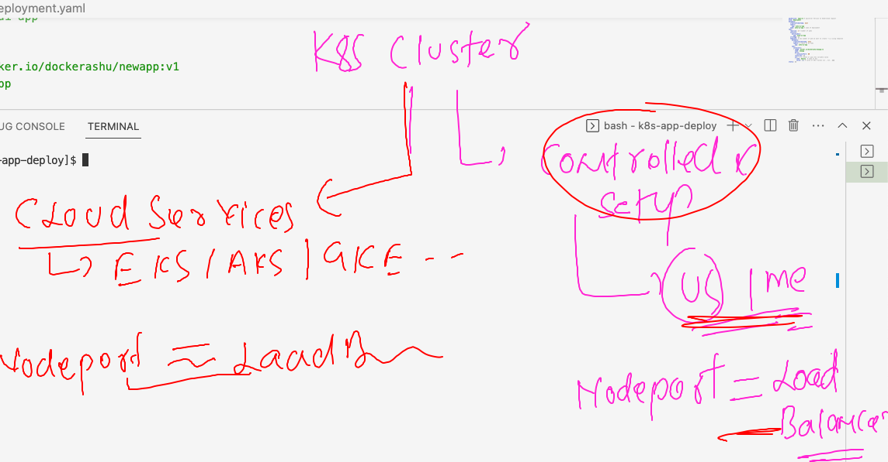

## REvision 

### application COntainerization process 


### k8s control plane/master and data plane / worker / minions 


### to deploy app -- we are having some k8s Resources like pod / rc / rs /deployment 


### Service introduction 


### creating deployment YAML using some Docker hub image 

```
kubectl   create  deployment  ashu-ui-app --image=docker.io/dockerashu/newapp:v1  --port 80 --dry-run=client  -o yaml  >day8_deployment.yaml 
```

### modifiy deployment file if required 

```
apiVersion: apps/v1 # apiserver Version to Understand request
kind: Deployment 
metadata:
  creationTimestamp: null
  labels:
    app: ashu-ui-app
  name: ashu-ui-app # name of deployment 
spec:
  replicas: 1 # number of pods 
  selector:
    matchLabels:
      app: ashu-ui-app
  strategy: {}
  template: # any number of pod we want to create --i.e using template 
    metadata:
      creationTimestamp: null
      labels: # lable of my Pods 
        app: ashu-ui-app
    spec:
      containers:
      - image: docker.io/dockerashu/newapp:v1
        name: newapp
        ports:
        - containerPort: 80
        resources: {}
        env: # to create or pass Env variable value 
        - name: deploy  # name of Env 
          value: ui3 # value of ENv--values ui1 , ui2 , ui3 
status: {}

```

### lets deploy 

```
[ashu@ip-172-31-29-207 k8s-app-deploy]$ ls
ashu_deployment.yaml  ashupod1.yaml  day8_deployment.yaml  newpod.yaml  nodeport.yaml
[ashu@ip-172-31-29-207 k8s-app-deploy]$ kubectl  create  -f  day8_deployment.yaml 
deployment.apps/ashu-ui-app created
[ashu@ip-172-31-29-207 k8s-app-deploy]$ kubectl  get  deploy
NAME          READY   UP-TO-DATE   AVAILABLE   AGE
ashu-ui-app   0/1     1            0           10s
[ashu@ip-172-31-29-207 k8s-app-deploy]$ kubectl  get  pods
NAME                             READY   STATUS              RESTARTS      AGE
ashu-ui-app-87d59bd5-mqnb5       1/1     Running             0             20s
mfarag-ui-app-688f66c45c-xvzmd   0/1     ContainerCreating   0             7s
shamaa-pod002                    1/1     Running             1 (17h ago)   23h
[ashu@ip-172-31-29-207 k8s-app-deploy]$ 

```

### Reality of Deployment 


### again understanding service usage and two types also 


### creating service using exposing deployment 

```
ashu_deployment.yaml  ashupod1.yaml  day8_deployment.yaml  newpod.yaml  nodeport.yaml
[ashu@ip-172-31-29-207 k8s-app-deploy]$ kubectl  get  deploy
NAME                  READY   UP-TO-DATE   AVAILABLE   AGE
abdo-ui-app           1/1     1            1           16m
amr-ui-app            1/1     1            1           12m
ashu-ui-app           1/1     1            1           17m
hhalkhazragy-ui-app   1/1     1            1           17m
ihor-ui-app           1/1     1            1           16m
mfarag-ui-app         1/1     1            1           17m
rjamaro-ui-app        1/1     1            1           15m
shamaa-ui-app         1/1     1            1           14m
[ashu@ip-172-31-29-207 k8s-app-deploy]$ kubectl  expose  deployment  ashu-ui-app  --type  NodePort  --port 1234 --target-port 80 --name ashu-lb111 --dry-run=client  -o yaml  >day8_nodeport.yaml 
[ashu@ip-172-31-29-207 k8s-app-deploy]$ kubectl create  -f  day8_nodeport.yaml 
service/ashu-lb111 created
[ashu@ip-172-31-29-207 k8s-app-deploy]$ kubectl  get  svc 
NAME         TYPE        CLUSTER-IP     EXTERNAL-IP   PORT(S)          AGE
ashu-lb111   NodePort    10.101.3.198   <none>        1234:30349/TCP   5s
kubernetes   ClusterIP   10.96.0.1      <none>        443/TCP          45h
[ashu@ip-172-31-29-207 k8s-app-deploy]$ 

```

### Understanding NodePort 


### creating Load Balancer service 

```
ashu@ip-172-31-29-207 k8s-app-deploy]$ kubectl  expose  deployment  ashu-ui-app  --type  LoadBalancer  --port 1234 --target-port 80 --name ashu-lb222 --dry-run=client  -o yaml  >day8_lbsvc.yam
[ashu@ip-172-31-29-207 k8s-app-deploy]$ kubectl create  -f  day8_lbsvc.yam 
service/ashu-lb222 created
[ashu@ip-172-31-29-207 k8s-app-deploy]$ kubectl  get  svc
NAME                 TYPE           CLUSTER-IP       EXTERNAL-IP   PORT(S)          AGE
abdo-lb111           NodePort       10.99.236.148    <none>        2002:30183/TCP   13m
amr-lb111            NodePort       10.109.225.40    <none>        1234:30738/TCP   13m
ashu-lb111           NodePort       10.101.3.198     <none>        1234:30349/TCP   14m
ashu-lb222           LoadBalancer   10.107.223.126   <pending>     1234:31533/TCP   4s
hhalkhazragy-10111   NodePort       10.100.214.72    <none>        1982:31560/TCP   13m
ihor-lb111           NodePort       10.109.113.221   <none>        2365:31000/TCP   11m
kubernetes           ClusterIP      10.96.0.1        <none>        443/TCP          45h
mfarag-lb111         NodePort       10.103.34.89     <none>        2244:30801/TCP   14m
rjamaro-lb           NodePort       10.96.4.107      <none>        3333:30952/TCP   13m
shamaa-lb111         NodePort       10.98.209.4      <none>        1244:30129/TCP   12m
[ashu@ip-172-31-29-207 k8s-app-deploy]$ 
```

### Load balancer & NodePort 



### Understanding & creating namespace in k8s 

```
ashu@ip-172-31-29-207 k8s-app-deploy]$ kubectl  get  namespaces 
NAME                   STATUS   AGE
default                Active   15d
ingress-nginx          Active   15d
kube-node-lease        Active   15d
kube-public            Active   15d
kube-system            Active   15d
kubernetes-dashboard   Active   15d
[ashu@ip-172-31-29-207 k8s-app-deploy]$ kubectl  get  pods
No resources found in default namespace.
[ashu@ip-172-31-29-207 k8s-app-deploy]$ kubectl  get  deploy 
No resources found in default namespace.
[ashu@ip-172-31-29-207 k8s-app-deploy]$ kubectl  create   ns  ashu-space  --dry-run=client -o yaml >ns.yaml 
[ashu@ip-172-31-29-207 k8s-app-deploy]$ kubectl  create   ns  ashu-space  
namespace/ashu-space created
[ashu@ip-172-31-29-207 k8s-app-deploy]$ kubectl  get  ns
NAME                   STATUS   AGE
ashu-space             Active   8s
default                Active   15d
ingress-nginx          Active   15d
kube-node-lease        Active   15d
kube-public            Active   15d
kube-system            Active   15d
kubernetes-dashboard   Active   15d
[ashu@ip-172-31-29-207 k8s-app-deploy]$ kubectl  config  set-context  --current --namespace=ashu-space 
Context "kubernetes-admin@kubernetes" modified.
[ashu@ip-172-31-29-207 k8s-app-deploy]$ 
[ashu@ip-172-31-29-207 k8s-app-deploy]$ kubectl   get  po
No resources found in ashu-space namespace.
[ashu@ip-172-31-29-207 k8s-app-deploy]$ kubectl   get  deploy 
No resources found in ashu-space namespace.
```

### Checking current namespace 

```
[ashu@ip-172-31-29-207 k8s-app-deploy]$ kubectl  config  get-contexts 
CURRENT   NAME                          CLUSTER      AUTHINFO           NAMESPACE
*         kubernetes-admin@kubernetes   kubernetes   kubernetes-admin   ashu-space
[ashu@ip-172-31-29-207 k8s-app-deploy]$ 


```


