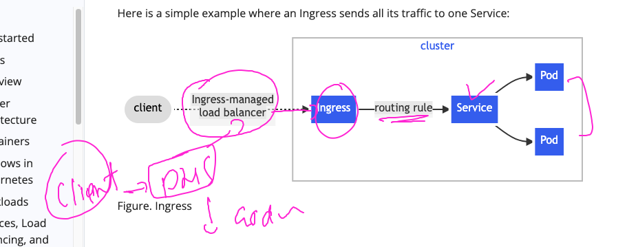
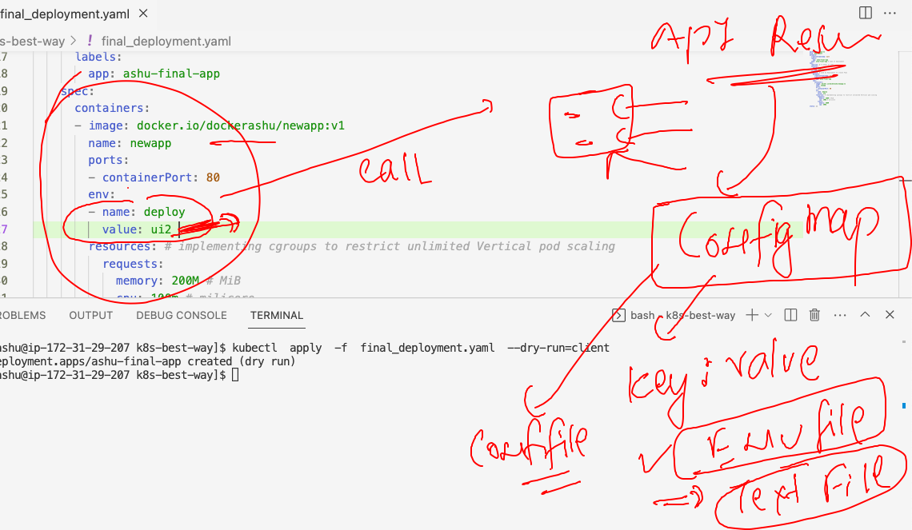
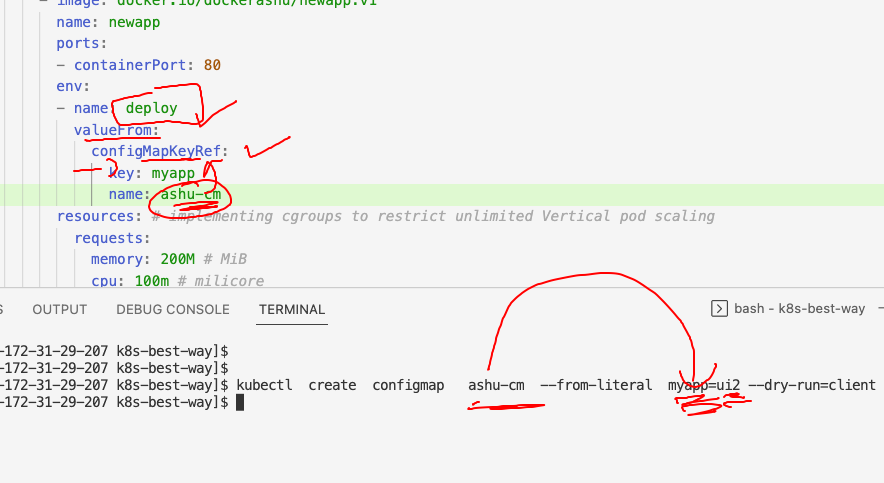

## Lab connect 

### checking 

```
[ashu@ip-172-31-29-207 ashu-app-images]$ kubectl  get  nodes
NAME            STATUS   ROLES                  AGE   VERSION
control-plane   Ready    control-plane,master   16d   v1.23.16
node1           Ready    <none>                 16d   v1.23.16
node3           Ready    <none>                 16d   v1.23.16
[ashu@ip-172-31-29-207 ashu-app-images]$ kubectl  config get-contexts 
CURRENT   NAME                          CLUSTER      AUTHINFO           NAMESPACE
*         kubernetes-admin@kubernetes   kubernetes   kubernetes-admin   ashu-space
[ashu@ip-172-31-29-207 ashu-app-images]$ kubectl  get  ns
NAME                   STATUS   AGE
abdo-space             Active   22h
amr-space              Active   22h
ashu-space             Active   22h
default                Active   16d
hhalkhazragy-space     Active   22h
ihor-space             Active   22h
ingress-nginx          Active   15d
kube-node-lease        Active   16d
kube-public            Active   16d
kube-system            Active   16d
kubernetes-dashboard   Active   16d
mfarag-space           Active   22h
rjamaro                Active   22h
shamaa-space           Active   22h
```
### Introduction to Ingress controller



### checking nginx ingress controller 

```
ashu@ip-172-31-29-207 ashu-app-images]$ kubectl  get  all -n ingress-nginx 
NAME                                           READY   STATUS    RESTARTS      AGE
pod/ingress-nginx-controller-bcd4c88f9-f2dwh   1/1     Running   3 (20h ago)   14d

NAME                                         TYPE        CLUSTER-IP       EXTERNAL-IP   PORT(S)                      AGE
service/ingress-nginx-controller             NodePort    10.103.158.63    <none>        80:30279/TCP,443:30317/TCP   16d
service/ingress-nginx-controller-admission   ClusterIP   10.108.127.171   <none>        443/TCP                      16d

NAME                                       READY   UP-TO-DATE   AVAILABLE   AGE
deployment.apps/ingress-nginx-controller   1/1     1            1           16d

NAME                                                 DESIRED   CURRENT   READY   AGE
replicaset.apps/ingress-nginx-controller-bcd4c88f9   1         1         1       16d

NAME                                       COMPLETIONS   DURATION   AGE
job.batch/ingress-nginx-admission-create   1/1           5s         16d
job.batch/ingress-nginx-admission-patch    1/1           6s         16d
[ashu@ip-172-31-29-207 ashu-app-images]$ 


```

### lets follow the best way to deploy app in k8s -- as per Industry standard 

### creating directory and putting everything there 

### creating deployment file 
```
[ashu@ip-172-31-29-207 ashu-app-images]$ mkdir  k8s-best-way 
[ashu@ip-172-31-29-207 ashu-app-images]$ cd  k8s-best-way/
[ashu@ip-172-31-29-207 k8s-best-way]$ ls
[ashu@ip-172-31-29-207 k8s-best-way]$ kubectl create deployment  ashu-final-app  --image=docker.io/dockerashu/newapp:v1  --port 80 --dry-run=client  -o yaml  >final_deployment.yaml 
[ashu@ip-172-31-29-207 k8s-best-way]$ 

```

### Introduction to COnfigmap 



### creating configmap to store variable in key value format 

```
kubectl  create  configmap   ashu-cm  --from-literal  myapp=ui2 --dry-run=client -o yaml >confimap.yaml[ashu@ip-172-31-29-207 k8s-best-way]$ 
```

### calling configmap in deployment file 



### lets deploy it 

```
[ashu@ip-172-31-29-207 k8s-best-way]$ ls
confimap.yaml  final_deployment.yaml
[ashu@ip-172-31-29-207 k8s-best-way]$ kubectl  apply -f  . 
configmap/ashu-cm created
deployment.apps/ashu-final-app created
[ashu@ip-172-31-29-207 k8s-best-way]$ kubectl   get  configmap 
NAME               DATA   AGE
ashu-cm            1      10s
kube-root-ca.crt   1      23h
[ashu@ip-172-31-29-207 k8s-best-way]$ kubectl   get  deploy 
NAME             READY   UP-TO-DATE   AVAILABLE   AGE
ashu-final-app   1/1     1            1           18s
[ashu@ip-172-31-29-207 k8s-best-way]$ kubectl   get  rs
NAME                        DESIRED   CURRENT   READY   AGE
ashu-final-app-7549b67bfb   1         1         1       25s
[ashu@ip-172-31-29-207 k8s-best-way]$ kubectl   get  po 
NAME                              READY   STATUS    RESTARTS   AGE
ashu-final-app-7549b67bfb-rv7kg   1/1     Running   0          28s
[ashu@ip-172-31-29-207 k8s-best-way]$ 
```
### implement HPA 

```
[ashu@ip-172-31-29-207 k8s-best-way]$ ls
confimap.yaml  final_deployment.yaml
[ashu@ip-172-31-29-207 k8s-best-way]$ kubectl  get  deploy 
NAME             READY   UP-TO-DATE   AVAILABLE   AGE
ashu-final-app   1/1     1            1           5m19s
[ashu@ip-172-31-29-207 k8s-best-way]$ kubectl  autoscale  deployment  ashu-final-app  --min=3  --max=15  --cpu-percent=80 --dry-run=client -o yaml  >hpa.yaml 
[ashu@ip-172-31-29-207 k8s-best-way]$ ls
confimap.yaml  final_deployment.yaml  hpa.yaml
[ashu@ip-172-31-29-207 k8s-best-way]$ kubectl  apply -f  . 
configmap/ashu-cm configured
deployment.apps/ashu-final-app configured
horizontalpodautoscaler.autoscaling/ashu-final-app created
[ashu@ip-172-31-29-207 k8s-best-way]$ kubectl   get  hpa 
NAME             REFERENCE                   TARGETS         MINPODS   MAXPODS   REPLICAS   AGE
ashu-final-app   Deployment/ashu-final-app   <unknown>/80%   3         15        1          20s
[ashu@ip-172-31-29-207 k8s-best-way]$ kubectl   get  deploy 
NAME             READY   UP-TO-DATE   AVAILABLE   AGE
ashu-final-app   3/3     3            3           7m48s
[ashu@ip-172-31-29-207 k8s-best-way]$ kubectl   get  po -o wide
NAME                              READY   STATUS    RESTARTS   AGE     IP                NODE    NOMINATED NODE   READINESS GATES
ashu-final-app-7549b67bfb-5qcg9   1/1     Running   0          20s     192.168.166.191   node1   <none>           <none>
ashu-final-app-7549b67bfb-fptsq   1/1     Running   0          20s     192.168.135.36    node3   <none>           <none>
ashu-final-app-7549b67bfb-rv7kg   1/1     Running   0          7m55s   192.168.135.31    node3   <none>           <none>
[ashu@ip-172-31-29-207 k8s-best-way]$ 
```

### with Ingress ---> we don't have to create NodePort or LB service type 

### creating clusterIP type service 

```
[ashu@ip-172-31-29-207 k8s-best-way]$ 
[ashu@ip-172-31-29-207 k8s-best-way]$ kubectl   get  deploy 
NAME             READY   UP-TO-DATE   AVAILABLE   AGE
ashu-final-app   3/3     3            3           19m
[ashu@ip-172-31-29-207 k8s-best-way]$ kubectl   expose deployment  ashu-final-app  --type ClusterIP --port 1234 --target-port 80 --name ashulb1  --dry-run=client -o yaml >clusterip.yaml 
[ashu@ip-172-31-29-207 k8s-best-way]$ ls
clusterip.yaml  confimap.yaml  final_deployment.yaml  hpa.yaml
[ashu@ip-172-31-29-207 k8s-best-way]$ kubectl apply -f . 
service/ashulb1 created
configmap/ashu-cm configured
deployment.apps/ashu-final-app configured
horizontalpodautoscaler.autoscaling/ashu-final-app configured
[ashu@ip-172-31-29-207 k8s-best-way]$ kubectl   get  svc
NAME      TYPE        CLUSTER-IP       EXTERNAL-IP   PORT(S)    AGE
ashulb1   ClusterIP   10.108.198.236   <none>        1234/TCP   23s
[ashu@ip-172-31-29-207 k8s-best-way]$ 
```

### checking overall things 

```
[ashu@ip-172-31-29-207 k8s-best-way]$ kubectl   get   deploy,cm,hpa,svc
NAME                             READY   UP-TO-DATE   AVAILABLE   AGE
deployment.apps/ashu-final-app   3/3     3            3           22m

NAME                         DATA   AGE
configmap/ashu-cm            1      22m
configmap/kube-root-ca.crt   1      23h

NAME                                                 REFERENCE                   TARGETS   MINPODS   MAXPODS   REPLICAS   AGE
horizontalpodautoscaler.autoscaling/ashu-final-app   Deployment/ashu-final-app   1%/80%    3         15        3          15m

NAME              TYPE        CLUSTER-IP       EXTERNAL-IP   PORT(S)    AGE
service/ashulb1   ClusterIP   10.108.198.236   <none>        1234/TCP   2m2s
[ashu@ip-172-31-29-207 k8s-best-way]$ 


```

### Nginx app routing rule yaml 

```
apiVersion: networking.k8s.io/v1
kind: Ingress
metadata:
  name: ashu-app-rule # routing rule name 
  annotations:
    nginx.ingress.kubernetes.io/rewrite-target: /
spec:
  ingressClassName: nginx # name of ingress product class 
  rules:
  - host: me.ashutoshh.in # domain name of my app 
    http: # remove - from here 
      paths:
      - path: /  # my app home page 
        pathType: Prefix
        backend:
          service:
            name: ashulb1 # name of service to forward traffic 
            port:
              number: 1234 # port of service 
```

### apply ingress and check 

```
[ashu@ip-172-31-29-207 k8s-best-way]$ kubectl  apply -f . 
ingress.networking.k8s.io/ashu-app-rule created
service/ashulb1 configured
configmap/ashu-cm configured
deployment.apps/ashu-final-app configured
horizontalpodautoscaler.autoscaling/ashu-final-app configured
[ashu@ip-172-31-29-207 k8s-best-way]$ kubectl   get  ingress  
NAME            CLASS   HOSTS             ADDRESS   PORTS   AGE
ashu-app-rule   nginx   me.ashutoshh.in             80      19s
[ashu@ip-172-31-29-207 k8s-best-way]$ 
```


